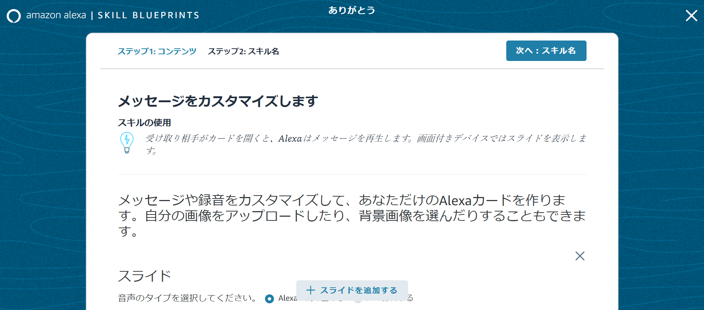
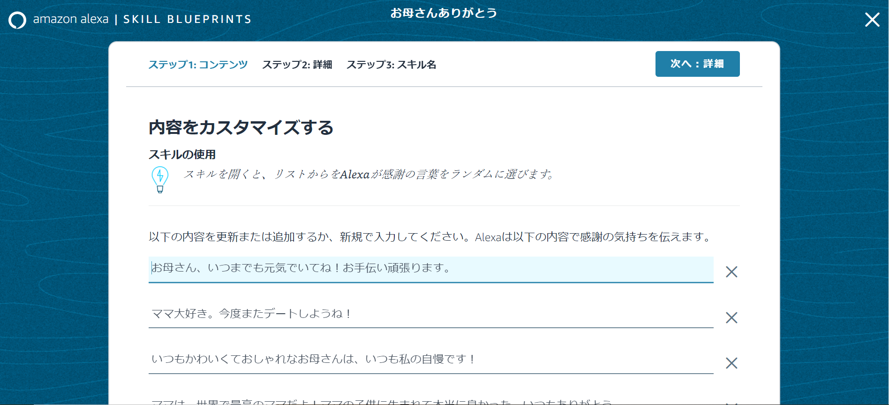
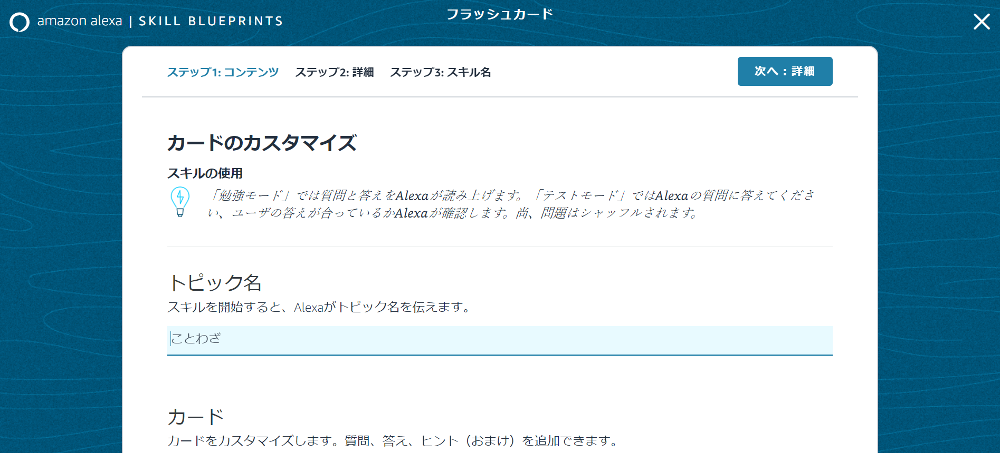
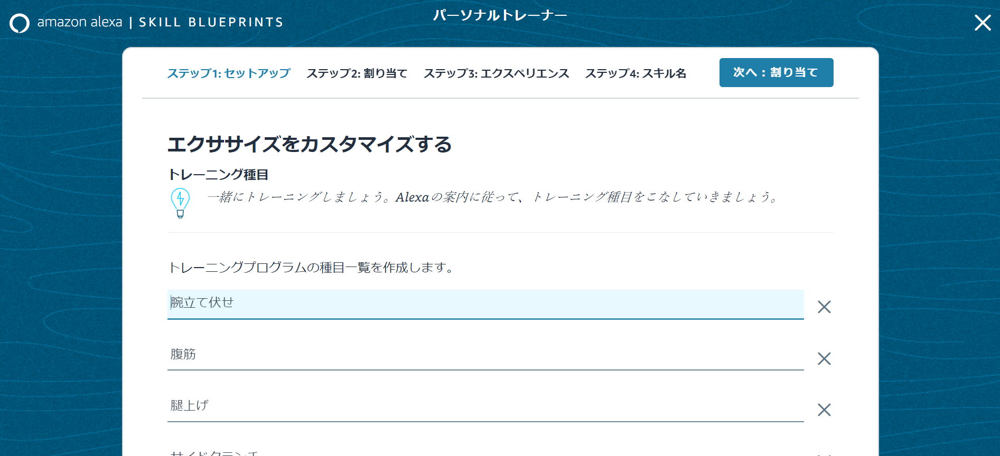
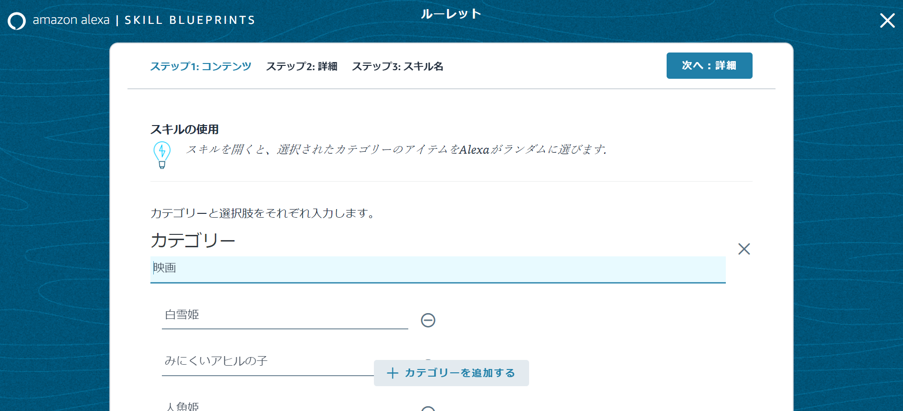
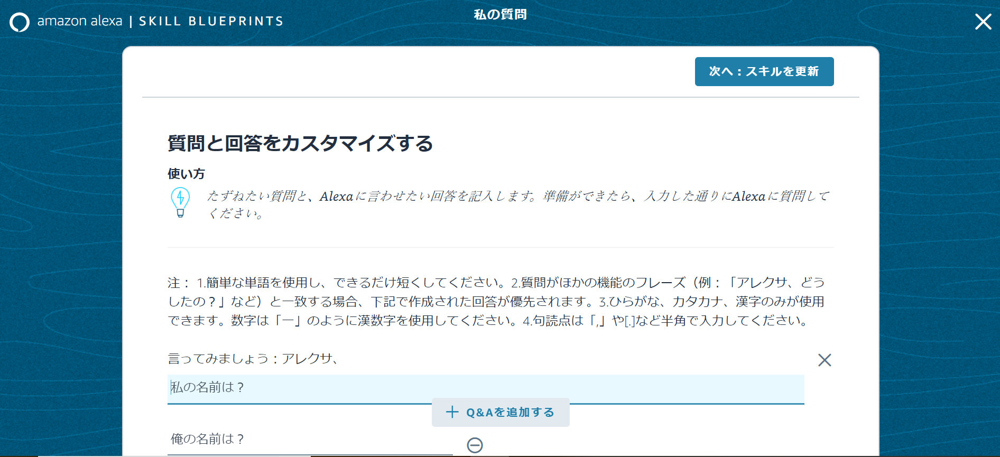
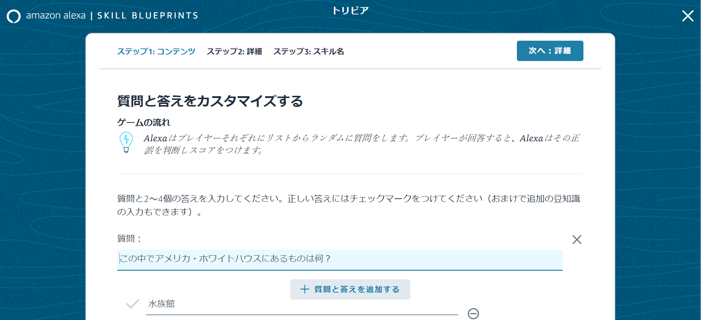

# オレトクなスキルを手軽に作るには
ノンコーディングで開発可能なVoiceflow、そろそろご自分でAlexaスキルやGoogleアクション（以降「スキル」）を開発してみたくなったのではないでしょうか。

では、実際どんなスキルを開発すれば良いか、Voiceflowは、その特性上、非エンジニアの方がちょっとしたスキルを作るのにも向いているように思います。
スキルを開発して、みんなに作ってもらうのも良いけれど、自分の生活向上のために、自分だけのスキルを手軽に作る、こんなことも、ノンコーディングのVoiceflowだからこそのメリットではないでしょうか。

本章では、ご自分の生活に寄り添うスキルのユースケースを考え、是非、「オレトク」なスキル開発にチャレンジしてみましょう！

## 生活に寄り添うスキルのユースケース
自分の生活を

両手がふさがっているとき
操作方法の学習コストの低さ

## VUIは高齢者向け？
私は普段、介護関係のエンジニアをしていますが、VUIは高齢者向けのインターフェースであると感じています。
理由としては、以下の二点です。
* 慣れ親しんだ、「会話」で操作可能
* モニターを見る必要がないため、老眼でも大丈夫

VUIは生活に根差したもの
VUIは高齢者でも使いこなせる可能性が高い
VUIはITリテラシーの低い人でも
音声

## Blueprintsという選択肢も！
Voiceflowdと同様にノンコーディングでAlexaスキルを開発する方法として、Blueprintsというものがあります。

[https://blueprints.amazon.co.jp/](https://blueprints.amazon.co.jp/)にアクセスしてください。

Blueprintsは、あらかじめひな形となるテンプレートがあり、それに対してカスタマイズするだけで、簡単にAlexaスキルを作成することが可能です。
2020年01月現在、テンプレートは以下のようなものがあります。

* グリーティング系（夏のお便り/お祝い/ありがとう/誕生日祝い）
* ランダムメッセージ系（お父さんありがとう/お母さんありがとう）
* フラッシュカード
* パーソナルトレーナー
* ルーレット
* カスタムQ&A
* トリビア

### グリーティング系
第三者へのメッセージスキルです。
第三者へのメッセージをテキストで入力したり、音声を録音、Echo Showなどのディスプレイへの画像を設定することができます。

### ランダムメッセージ系
グリーティング系と似ているのですが、あらかじめ複数のメッセージを登録しておき、それがランダムで選択されます。

### フラッシュカード
学習用のスキルです。
質問、回答、ヒントを入力します。
テストをすることも可能です。

### パーソナルトレーナー
トレーニング用のスキルです。
運動内容や秒数、応援メッセージを入力します。

### ルーレット
抽選用のスキルです。
選択肢のリストを入力し、何かを決めるときに使えます。

### カスタムQ&A
Q&A形式のスキルです。
忘れやすいような内容を入力しておいて、忘れたときに教えてもらうように使えます。
唯一、本スキルだけは、スキル名を言う必要はありません。

### トリビア
1～4人で、クイズができるスキルです。

## 非エンジニアでもスキルを作ろう！
これまで見たように、ノンコーディングでもスキルの開発は可能です。
Blueprintsはあらかじめ用意されたテンプレートに沿ったスキルしか作成できない代わりに、非常に簡単にスキルを作成でき、VoiceflowはBlueprintsよりも、複雑になりますが、自由にスキルを作成できます。
どちらか片方ではなく、VoiceflowとBlueprintsを適材適所で使用すればよいと思います。
是非、スキル開発にチャレンジしてください！
