# BMI測定結果をAmazon Connectから電話で教えてもらう
身長と体重を答えると、その数値を元にBMIを測定します。測定結果をAmazon Connectというサービスを経由して、
ご自身の携帯電話に電話がかかってくるというものを作ってみました。実際に電話がかかってくると感動しますね。

## しくみ
Voiceflowで構築したAlexaに対して身長と体重を答えます。その値を元にAWS Lambda上でBMIの計算を行います。
その計算結果をAmazon Connectを経由して電話で結果を教えてくれます。


## 準備
各種準備をこれから行っていきます。必要なものは以下の通りです。

* 電話番号の発行
* 問い合わせフローの作成
* AWS Lambda関数の作成
* API Gatewayの設定
* Voiceflowの設定

それでは順番に用意していきます。

### Amazon Connect 電話番号の発行

#### リソースを作成する
AWS にアクセスし、お持ちの AWS アカウントでログインします。

[https://aws.amazon.com/jp/](https://aws.amazon.com/jp/)@<br>{}

コンソール画面が開いたら、サービス検索から【Amazon Connect】と入力して検索します。出てきた `Amazon Connect` をクリックします。


［今すぐ始める］ボタンをクリックします。


東京リージョンになっているか確認してください。なっていない方は右上から「アジアパシフィック（東京）」を選択します。


アクセスURLに今回使用するための名前を決めます。［vf-techbookfest-{あなたのお名前}］という感じで、他の人と被らないような名前にします。


ステップ２の管理者の作成は後で、できるので「これをスキップ」を選択してから、［次のステップ］ボタンをクリックします。


ステップ３のテレフォニーオプションはそのまま何もせず［次のステップ］ボタンをクリックします。


ステップ４のデータストレージもそのまま［次のステップ］ボタンをクリックします。


ステップ５で最終確認をして問題なければ［インスタンスの作成］ボタンをクリックします。


1〜2分ほど作成に時間がかかります。


成功すれば、［今すぐ始める］ボタンをクリックします。


#### 電話番号を取得する
Amazon Connect専用の電話番号を手に入れます。
別のタブでAmazon Connect用の画面が表示されるので、そこに表示されている［今すぐ始める］ボタンをクリックします。

日本語になっていない場合は右上から「日本語」を選択してください。


電話番号の取得で、国はJapan +81を選択します。


次のタイプは2種類あります。お好きな方を選んでください。


最後にお好きな番号を選択して、［次へ］ボタンをクリックします。


［Continue］ボタンをクリックします。これで電話番号が発行されました。


#### 発行した電話番号を確認する
取得した電話番号を確認します。
左メニューからルーティングの電話番号をクリックします。


取得した電話番号が表示されています。別の番号を増やしたい場合は右側にある［電話番号の追加］ボタン押して追加できます。この電話番号はのちほど使うので、メモしておきましょう。


### 問い合わせフローを作成しよう
Amazon Connectで電話がかかってきたときのフローを作成します。GUI画面でポチポチ配置するだけで簡単に作成できます。

#### 問い合わせフローを作成する
左側メニューのルーティングから「問い合わせフロー」をクリックします。


［問い合わせフローの作成］をクリックします。


名前を「Voiceflow-AmazonConnect」と入力します。


設定カテゴリにある「音声の設定」ブロックをドラッグ&ドロップして、ドロップしたブロックをクリックします。


言語は「日本語」でお好きな音声を選択してください。


エントリポイントと音声の設定ブロックをつなげます。


設定カテゴリにある「問い合わせ属性の設定」をドラッグ&ドロップします。


属性の設定を行います。「属性を使用する」を選択してください。


ブロックをつなげます。


操作カテゴリにある「プロンプトの再生」をドラッグ&ドロップします。


属性の設定を行います。「テキスト読み上げまたはチャットテキスト」を選択してください。


ブロックをつなげます。


ブランチカテゴリにある「ループ」をドラッグ&ドロップします。
ループ回数はお好きな数を指定してください。


ブロックをつなげます。


ループとプロンプトの再生をつなげます。


終了 / 転送カテゴリにある「切断/ハングアップ」をドラッグ&ドロップします。


まだつないでいない部分をすべて「切断/ハングアップ」につなぎます。


右上の①［保存］と②「公開」ボタンを順番にクリックします。


#### IDをメモしておく
問い合わせフローの名前の下に「追加のフロー情報の表示」という項目があるので、それを展開します。展開するとARNの情報が表示されるので `instance` のIDと `constact-flow` のIDをそれぞれメモしておきます。


### Lambda関数を作成しよう
Voiceflow側から送られてくる身長と体重データを計算して結果をAmazon Connectに知らせる処理を実装していきます。

#### Lambda関数を作成する
サービスから `Lambda` を検索して、出てきたものをクリックします。


Lambdaから新規で関数を作成します。［関数の作成］ボタンをクリックします。


関数は以下の通り入力して、［関数の作成］ボタンをクリックします。


#### Amazon Connectアクセス権限を追加する
Voiceflow-AmazonConnect-Roleロールを表示をクリックします。


［インラインポリシーの追加］をクリックします。


サービスを展開して、検索窓に「Connect」と入れて検索します。出てきた［Connect］をクリックします。


アクションのアクセスレベルにある「書き込み」部分を展開して、その中にある`StartOutboundVoiceContact`のチェックを入れます。


すべてのリソースを選択して、右下の［ポリシーの確認］ボタンをクリックします。


ポリシー名を入力します。`Voiceflow-AmazonConnect-Policy`としました。右下の［ポリシーの作成］ボタンをクリックします。


#### プログラムを書き込む
index.jsを開きます。既存ソースはすべて削除して、下記プログラムをコピー&ペーストしてください。
Voiceflowからリクエストが飛んでくるので、bodyから対象値を取得します。

```javascript
const Util = require('./util.js');

exports.handler = async (event) => {

    // 身長と体重の値を取得
    const height = event.queryStringParameters.height;
    const weight = event.queryStringParameters.weight;
    
    const bmiVal = (parseFloat(weight) / (parseFloat(height)/100 * parseFloat(height)/100)).toFixed(1);
    const message = `あなたのBMIは${bmiVal}です。`;
    
    const response = {
        statusCode: 200,
        body: "結果は電話でお知らせします。",
    };

    // Amazon Connect送信
    await Util.callMessageAction(message);

    return response;
};
```

新規ファイルを作成します。


下記コードをコピー&ペーストしてください。

```javascript
'use strict';
const AWS = require('aws-sdk');
var connect = new AWS.Connect();

// 電話をかける処理
module.exports.callMessageAction = async function callMessageAction(message) {
    return new Promise(((resolve, reject) => {

        // Attributesに発話する内容を設定
        var params = {
            Attributes: {"message": message},
            InstanceId: process.env.INSTANCEID,
            ContactFlowId: process.env.CONTACTFLOWID,
            DestinationPhoneNumber: process.env.PHONENUMBER,
            SourcePhoneNumber: process.env.SOURCEPHONENUMBER
        };

        // 電話をかける
        connect.startOutboundVoiceContact(params, function(err, data) {
            if (err) {
                console.log(err);
                reject();
            } else {
                resolve(data);
            }
        });
    }));
};
```

保存する際はファイル名を `util.js` にしてください。


#### 環境変数を設定する
Amazon Connectと連携するための環境変数を設定します。

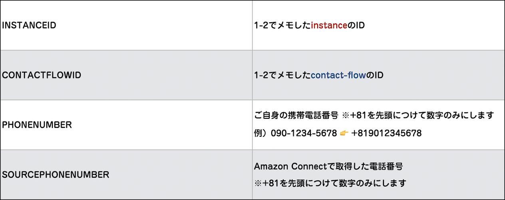


#### API Gatewayを設定する
VoiceflowからアクセスするためのURLを発行します。
［トリガーを追加］をクリックします。


トリガーの設定は下記を指定します。最後に［追加］ボタンをクリックします。


APIエンドポイントのURLをメモしておきましょう。


右上の保存ボタンをクリックします。


## Voiceflowを設定しよう
ここからVoicelflowで設定を行います。Voiceflowにアクセスしてログインしてください。@<br>{}

[https://www.voiceflow.com/](https://www.voiceflow.com/)

### プロジェクトを作成する
Voiceflowのプロジェクトを作成していきます。こちらもGUI画面で簡単に作成できます。

#### 新規プロジェクト作成
ログインしたら［New Project］ボタンをクリックします。


プロジェクト名を入力します。今回は `VoiceflowBMI` としました。Englishのチェックは外して、Japanese（JP）にチェックを入れます。最後に［Create Project］ボタンをクリックします。


`Speak` ブロックをドラッグ&ドロップして、Alexaに発話してもらう言葉を入力します。まずは利用者の身長を聞きたいので、「BMIを測定します。身長をセンチでお答えください。」と入力します。

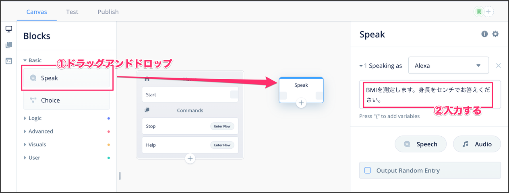

ブロックを線でつなぎます。


身長と体重の値をそれぞれ変数に格納したいので、変数名を登録します。 `height` 、 `weight` 、 `res` をそれぞれ登録します。

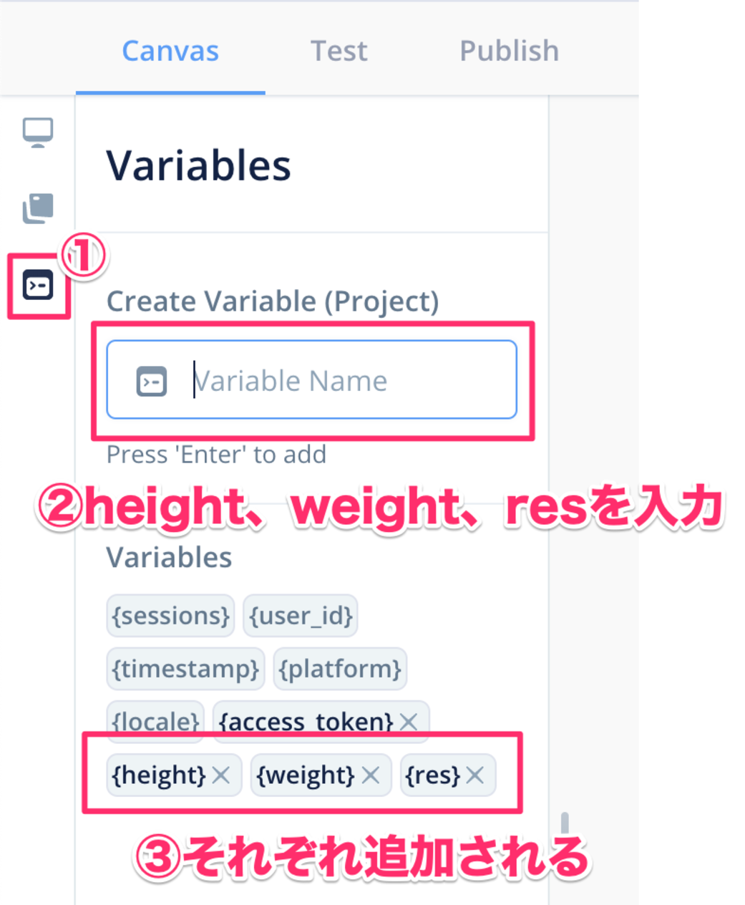

Logicカテゴリにある `Capture` ブロックをドラッグ&ドロップします。 `Speak` ブロックと線でつないで、 Input Typeは数字を手に入れたいので `FourDigitNumber` を選択します。 Capture Input toには 作った変数 `{height}` に格納したいので、格納する変数名を指定します。

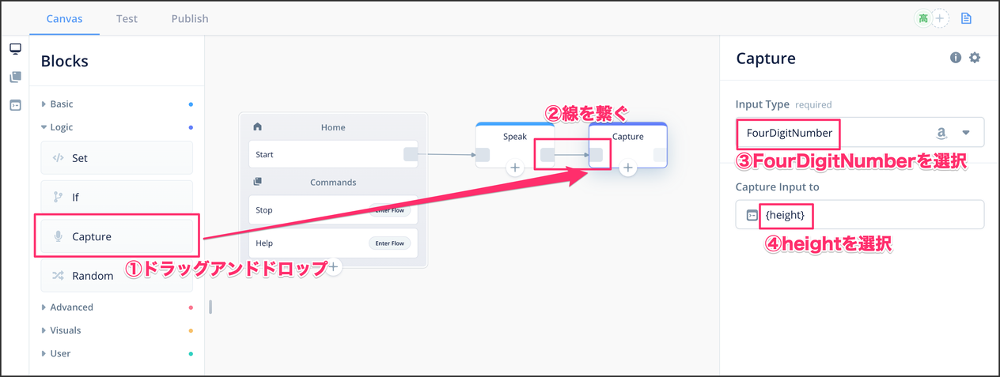

`Speak` ブロックをドラッグ&ドロップして線でつなぎます。続いて体重を聞きたいので、「続いて体重をキログラムでお答えください。」と入力します。

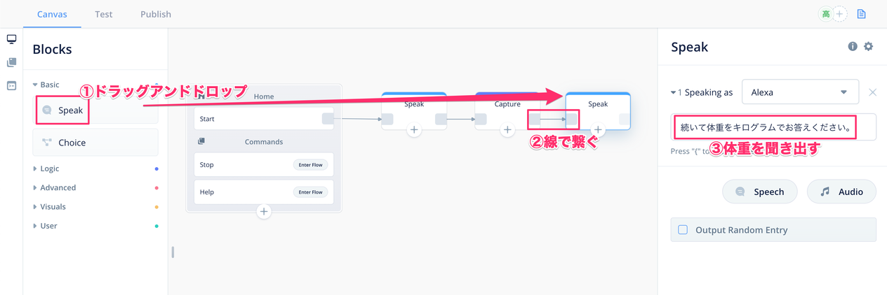

Logicカテゴリにある `Capture` ブロックをドラッグ&ドロップします。 身長と同様に `FourDigitNumber` を選択します。 Capture Input toには 作った変数 `{weight}` に格納したいので、格納する変数名を指定します。

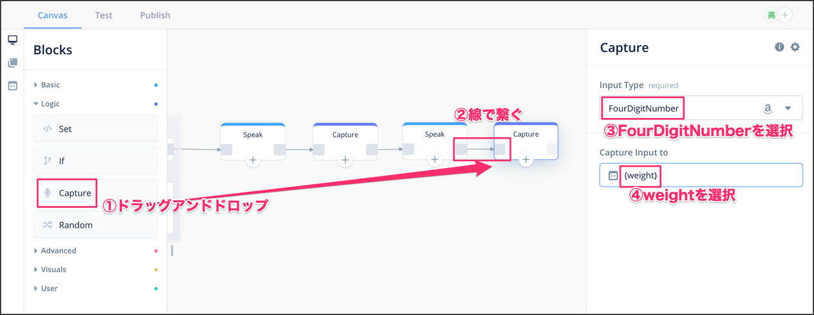

Advancedカテゴリにある `Integrations` ブロックをドラッグ&ドロップします。 `Capture` と線でつないで Request URLにAPI Gatewayで発行されたURLを貼り付けます。メソッドは必ず `POST` を選択します。 Paramsタグをクリックして、渡すパラメータを設定します。

Entry Parameter key部分に身長と体重のパラメータを設定します。 `height` と `weight` をそれぞれKeyとValueに設定します。APIからの結果を格納するので、Transform info VariablesのEnter Object path部分に `response` と入力して、 変数名 `res` を選択します。

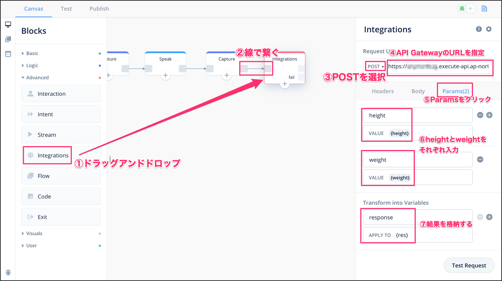

`Speak` ブロックをドラッグ&ドロップして、上側を線でつなぎます。変数 `res` の内容を発話してもらうために、変数名 `res` を入力します。

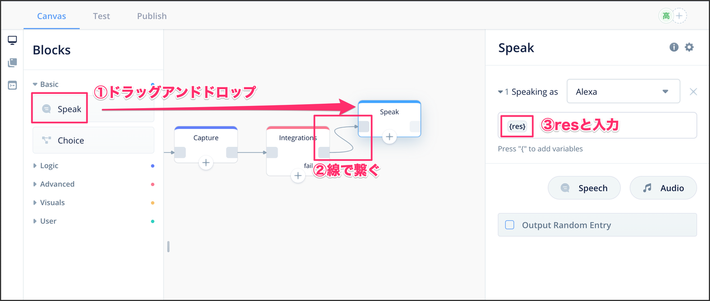

API Gatewayで何らかのエラー発生時の文言を入力します。

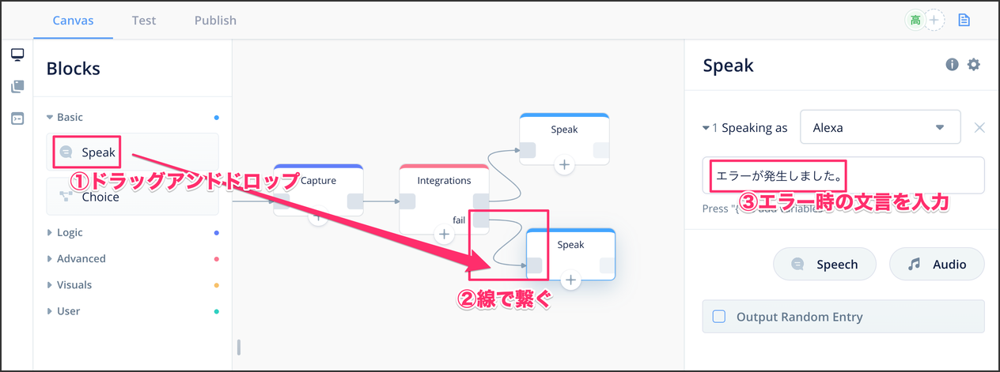

スキルを終了させるためにAdvancedカテゴリの `Exit` ブロックをドラッグ&ドロップします。
上下のブロックをつなげます。

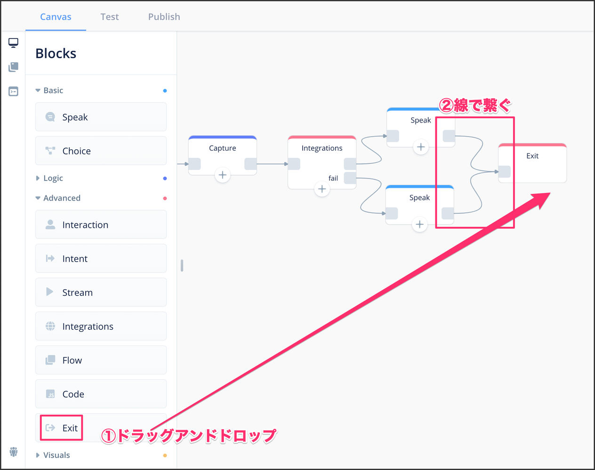

#### 動作確認
ここまでフローができたらいよいよAlexaにデプロイします。画面右上の `Upload to Alexa` のボタンをクリックします。まだAmazonとリンクされていない方は `Connect Amazon` ボタンを押してください。

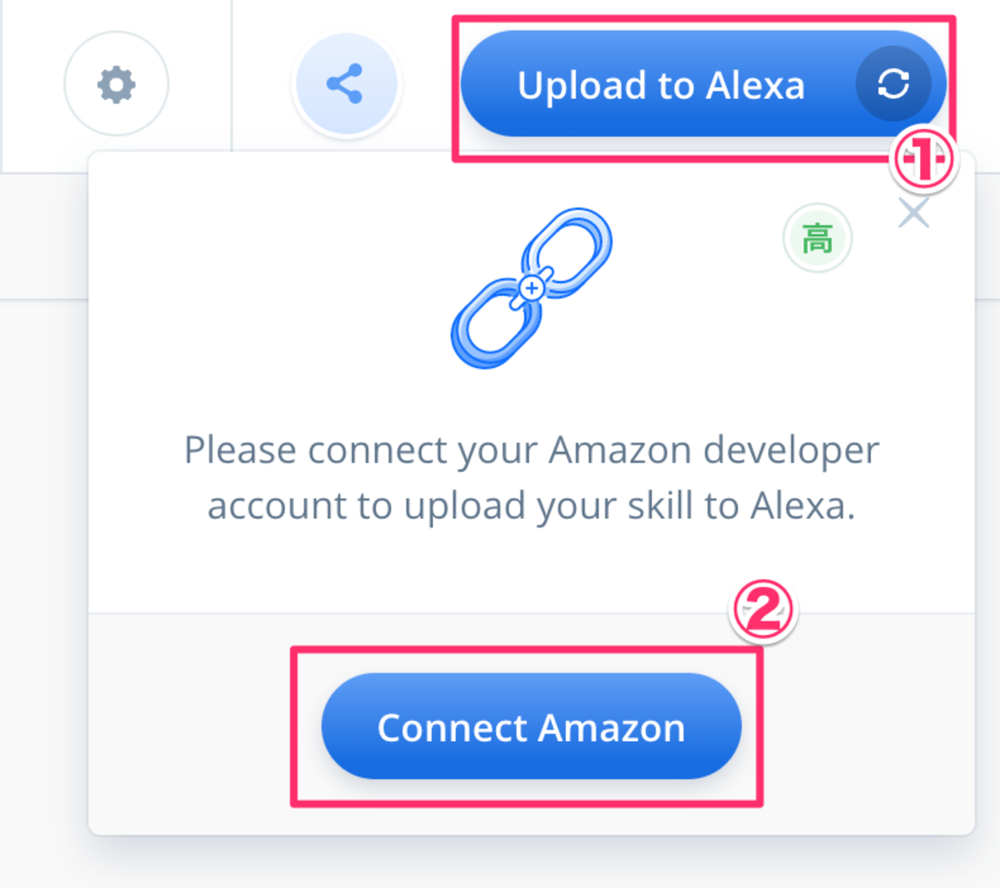

アップロードが完了したら `Amazon Console` のリンクをクリックします。


alexa developer console画面が表示されるので、 「voiceflowbmiをひらいて」 と入力します。身長と体重を入力すると、ご自身の携帯電話に電話がかかってきます。


Voiceflowを使えばAmazon Connectの連携もあっという間に実装できました。いろんな連携を試して皆さんで一緒に「がおって」みましょう。

