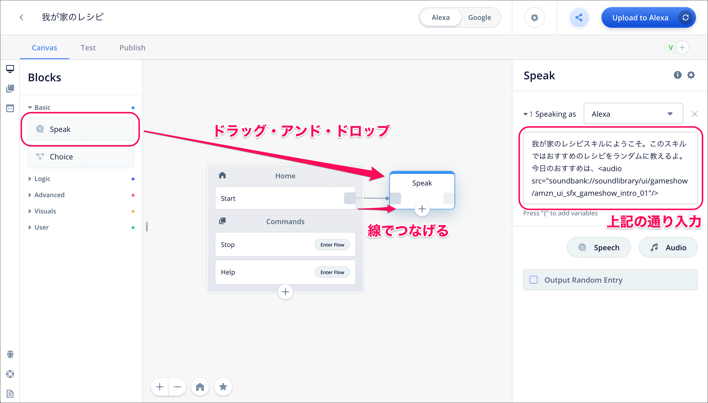
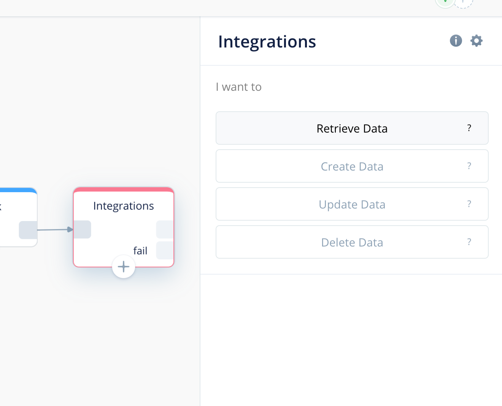
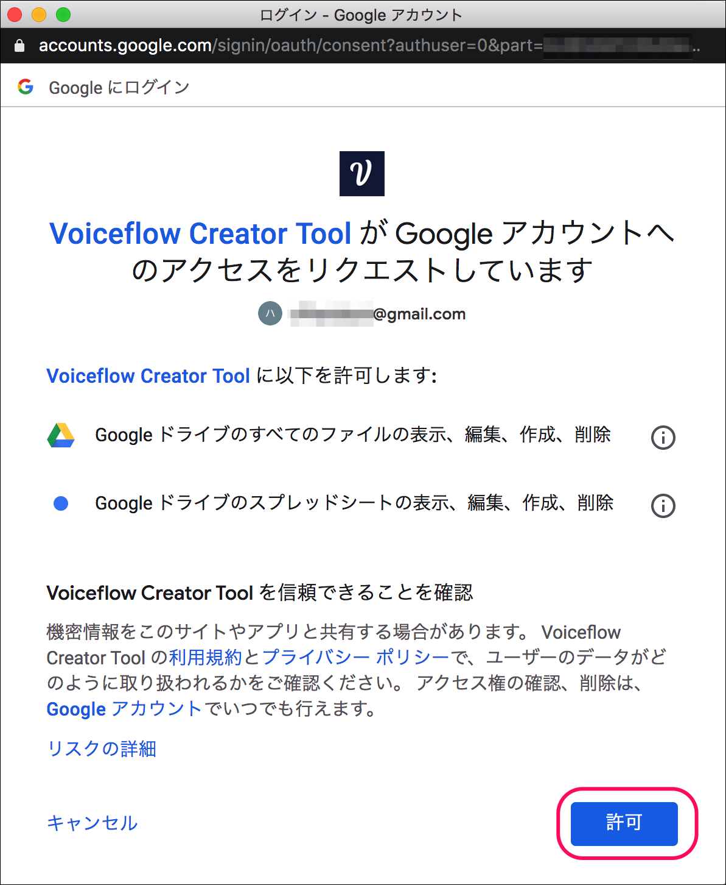
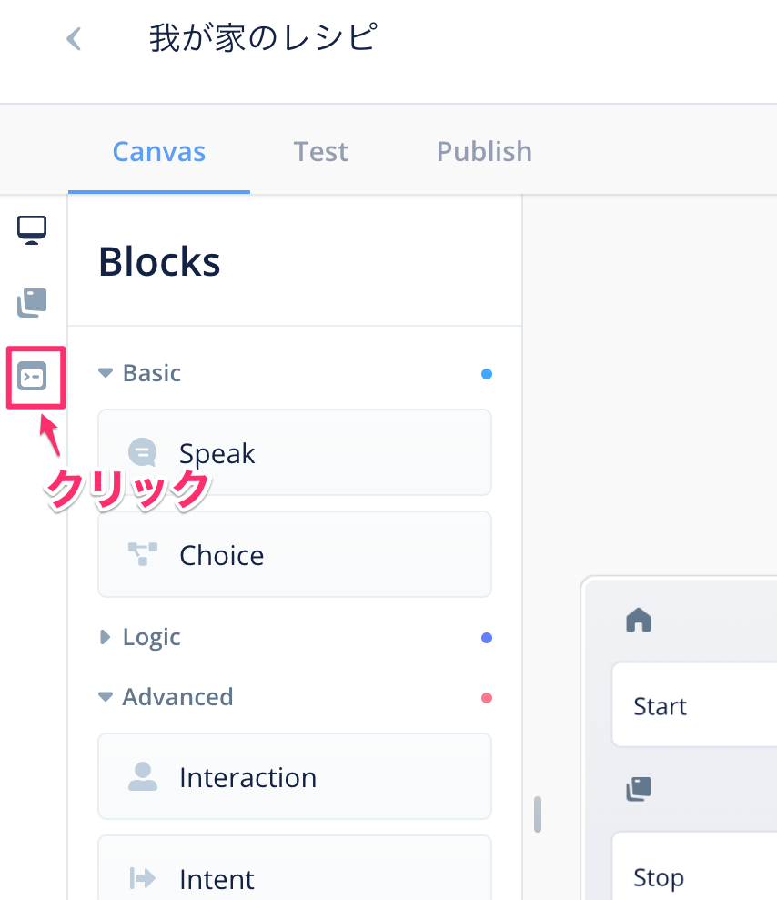
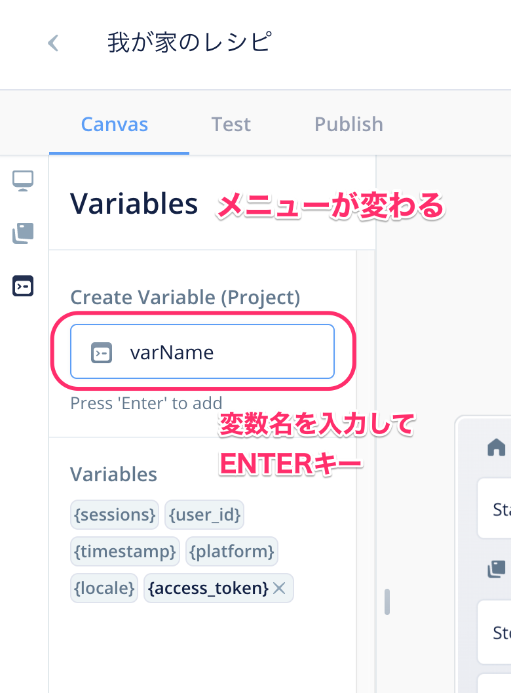
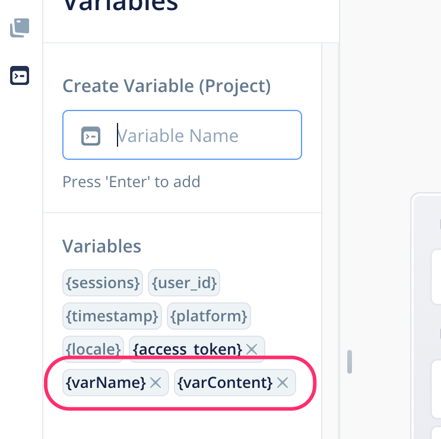
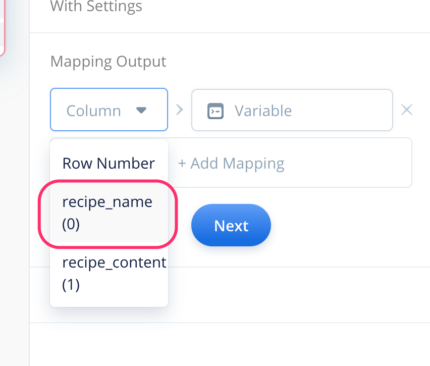
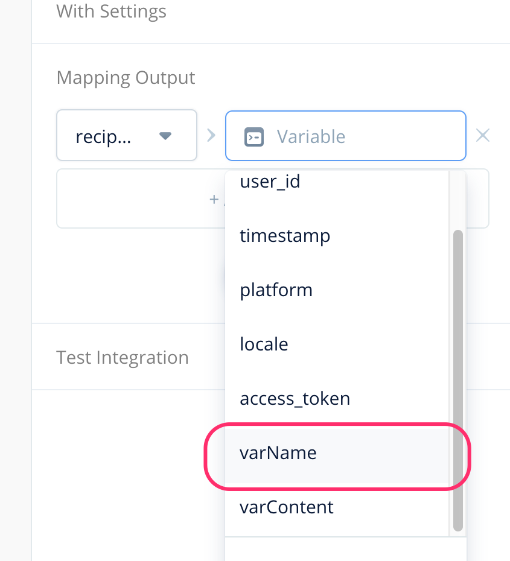

# Googleスプレッドシートと連携してみよう

VoiceflowのGoogleスプレッドシート連携機能を使うと、普段お使いのExcelと同じ使い勝手で使える簡易なデータベースとして利用できますので、スキル開発の幅が一気に広がります。ぜひ活用してワンランク上のスキルを作ってみましょう。

## スプレッドシートのデータをランダムに呼び出す

最初に、VoiceflowのGoogleスプレッドシート連携の基本的な使い方を学びつつ、シートからランダムにデータを取り出すというのをやってみましょう。サンプルとして、Googleスプレッドシートに登録してあるオススメのレシピとその材料をランダムに教えてくれるスキルを作っていきたいと思います。

### スプレッドシートの作成と、スキルの基本部分の作成

最初に、お持ちのGoogleアカウントでGoogleスプレッドシートにログインし、以下のようなスプレッドシートを作成してください。


- スプレッドシート名は「我が家のレシピデータ」とします。
- シート名（下のタブ）は「レシピ一覧」とします。
- 以下のようなデータを入力します。
  - A1に```recipe_name```、B1に```recipe_content```と入力します。1行目が必ず見出しの行となります。日本語での指定はできませんのでご注意ください。
  - 2行目以降は、A列にレシピ名、B列に材料を入力していきます。

次に、Voiceflow側で以下のようなプロジェクトを作成して、ブロックを配置してください。



- プロジェクト名は「我が家のレシピ」とします。言語は「Japanese(ja-JP)」のみを選択してください。
- プロジェクトが作成されたら、Speakブロックを1つ配置し、HomeブロックのStartと線でつなげます。
- Speakブロックの中は以下を入力してください。最後の```<audio src=・・・```のところは、Alexa Skills Kitサウンドライブラリを使って音楽を流すようにしています。

```
我が家のレシピスキルにようこそ。このスキルではおすすめのレシピをランダムに教えるよ。今日のおすすめは、<audio src="soundbank://soundlibrary/ui/gameshow/amzn_ui_sfx_gameshow_intro_01"/>
```

### Googleスプレッドシートとの連携を行う「Integrationブロック」

Googleスプレッドシートとの連携は「Integrationブロック」を使います。左のBlocksメニューにあるAdvancedから、Integrationブロックをドラッグ・アンド・ドロップでSpeakブロックの右側に配置して、線でつないでください。


右側に表示されるIntegrationブロックの設定で、「Google Sheets」（Googleスプレッドシートのことを英語ではGoogle Sheetsと呼びます）をクリックします。


まず、シートのデータをどうしたいのか？を選択します。 選択できるのは以下の4つです。



- Retrieve Data（データの取得）
- Create Data（データの登録）
- Update Data（データの更新）
- Delete Data（データの削除）

このスキルでは、レシピ名と材料名のデータをGoogleスプレッドシートから取り出しますので、「Retrieve Data」クリックします。


次に、GoogleスプレッドシートへアクセスするためにGoogleアカウントとの紐付けを行います。「＋Add User」をクリックします。


はじめてアカウント連携を行う場合は以下のようにGooogleへのログインを促す画面が表示されます。「Login with Google」をクリックします。


Googleアカウントの選択画面が表示されますので、Googleスプレッドシートを作成したアカウントを選択します。アカウント・パスワードを入力する画面が表示される場合もあります。その場合はお手持ちのGoogleアカウントとパスワードでログインしてください。


初回のみ、VoiceflowからGoogleスプレッドシートへのアクセス許可設定を行う必要があります。「許可」をクリックします。



以下のように表示されればGoogleアカウントとの紐付けは完了しています。「Using Sheet」をクリックして次に進みます。


「Using Sheet」では、Voiceflowからアクセスするスプレッドシートを選択します。「Spreadsheet」でスプレッドシート名、「Sheet」でシート名（下のタブ名）をそれぞれリストから選択します。今回、最初に作成したスプレッドシートの場合だと、「Spreadsheet」に「我が家のレシピデータ」、「Sheet」に「レシピデータ一覧」を選択します。


スプレッドシートの選択が完了すると、「With Settings」が表示されます。ここは、あとで説明しますので、とりあえず左側の「Column」にリストから「Row Number」を選択してください。右側の「Value to Match」は何も入力せずに「Next」をクリックします。


「Mapping Output」のところも、あとで設定しますのでそのまま「Next」をクリックします。


「Test Integration」では、実際にGoogleスプレッドシートへの接続テストが行えます。「Test Integration」をクリックしてください。


「Test Integration」の下に、スプレッドシート内に記載されているレシピ名と材料が表示されていれば成功です。何度か「Test Integration」をクリックして、結果がランダムに変わることを確認してください。


### 変数を使ってスプレッドシートのデータをスキル内で使用する

Googleスプレッドシートとの連携ができましたが、まだスキル内からはそのデータを使うことはできません。スプレッドシートから取得したデータをスキル内で使用するには「変数」を使う必要があります。最初に変数を作成しましょう。

変数の作成は「Variablesメニュー」から行います。画面の一番左、縦に3つ並んでいるアイコンの中から、一番下のアイコンをクリックしてください。



今まで表示されていた「Blocksメニュー」から表示が切り替わりました。これが「Variablesメニュー」です。「Create Variable」と書いてあるすぐ下の入力フォームに変数名を入力してENTERキーを押すと変数が作成されます。まず```varName```と入力してENTERキーを押してください。



入力欄のすぐ下に表示されている ```\{sessions\}``` 等の最後に```varName```が表示されていれば、変数の作成成功です。同様に、```varContent```という変数も作成してください。


以下のように2つの変数が作成されていればOKです。一番左の3つのアイコンの、一番上のアイコンをクリックして「Blocksメニュー」に戻りましょう。



次に、Googleスプレッドシートから取得したデータを変数と紐付けます。これにより他のブロックから変数に入っているデータ（「値」と言います）を呼び出すことができるようになります。Integration Blockをクリックして設定画面を表示し、「Mapping Output」をクリックします。


変数と取得したデータの紐付けは「Mapping Output」で行います。「+Add Mapping」をクリックします。


「+Add Mapping」をクリックすると、「Column」と「Variable」をそれぞれ選択できるようになります。「Column」でスプレッドシートから取得したデータのカラム名を、「Variable」でそれを紐付ける変数名を指定します。これでスプレッドシートのデータと変数が紐付けられるというわけです。


では、まず「レシピ名」から紐付けを行っていきましょう。「Column」をクリックして```recipe_name```を選択します。



次に「Variable」は```varName```を選択します。



これで、スプレッドシートの```recipe_name```カラムに入っていたデータが変数```varName```に入るようになりました。同様にして「材料、```recipe_content```カラムと変数```varContent```も紐付けます。「+Add Mapping」をクリックして同じように設定を追加してください。


2つとも紐付けができてこのようになっていればOKです。「Next」をクリックして「Test Integration」でテストしておいてください。


//note[注意]{
IntegrationブロックでGoogleスプレッドシート連携を選択した場合、「Test Integration」で確認できるのはスプレッドシートのデータが取得できたかどうか？だけで、データが変数に入ったかどうかまではわかりません。実際の確認はSpeakブロックなどでその変数を使ってみて確認する必要があります。
//}

では、スプレッドシートから取得したデータをスキルの中から使ってみましょう。Interactionブロックの横にSpeakブロックを配置して、Interactionブロックの「fail」と書いていない方とつなげます。


Speakブロックの設定は以下のように設定します。

```
{varName} です。材料は {varContent} です。
```

ではAlexa開発者コンソールにアップロードしてテストしてみましょう。何度かスキルを実行して、Googleスプレッドシートのデータが取得できていること、そして、データがランダムに変わることが確認できればOKです。


### Interactionブロックが失敗した場合に備える

便利なGoogleスプレッドシート連携も

//embed[latex]{
\clearpage
//}

わはは


## Googleスプレッドシートを使う場合の注意

お手軽で便利なGoogleスプレッドシート連携ですが、弱点もあります。

- 個人的な印象ですが、Googleスプレッドシートへのアクセスは、一般的なAPI等へのアクセスに比べると少しレスポンスが遅いと感じます。スキルの中でスプレッドシートへのアクセスを何度も行うと、利用者のスキル利用時のテンポやリズム感を損ねる可能性があることにご注意ください。
- また、Googleスプレッドシートへの高頻度のアクセスは、Googleからアクセス制限される可能性があります。一般的なスキル利用程度であれば問題ないと思いますが、スキルが人気になった場合などはこの制限の対象になる可能性があることにご注意ください。
- Googleスプレッドシートに大量のデータが存在する（行数や列数が多い、セル内の文字数が多い、等）場合、レスポンスが遅くなったり、データが取得できなくなったりする場合があります。行・列・セル内データ等の組み合わせにもよるので一概には言えませんが、多くても1000行未満に抑えることをオススメします。
- Googleスプレッドシートで検索する場合、検索対象の列は1つしか指定できません。一般的なデータベースで行うような複雑な検索条件は実行できませんのでご注意ください。

上記のような制限に合致したり、Googleスプレッドシートで機能的に物足りなくなった場合、AirtableやFirebaseなどの本格的なデータベースを利用することをオススメします。

- Airtable (@<href>{https://airtable.com/})
- Firebase (@<href>{https://firebase.google.com/})

## まとめ

いかがでしょうか？今回は取り上げませんでしたが、スプレッドシートへのデータの登録・更新・削除ももちろん可能です。

## 最後に

私のブログでいくつかGoogleスプレッドシート関連のチュートリアル的な記事を書いていますのでご紹介します。よろしければご覧ください。

「Voiceflow Tips #7 Googleスプレッドシート連携で作る豆知識スキル」@<br>{}
(@<href>{https://kun432.hatenablog.com/entry/voiceflow\_tips\_7\_fact\_skill\_integrated\_with\_google\_sheets})

初歩のAlexaスキル開発のサンプルとしてもよく取り上げられている「豆知識」スキルをGoogleスプレッドシートと連携させて作ります。Googleスプレッドシート側に豆知識の「ネタ」をたくさん登録しておいて、ランダムに呼び出すというものです。

- 「Voiceflow Tips #12 Googleスプレッドシート連携で作るゼロカロリースキル 〜スプレッドシートの検索〜」@<br>{}
(@<href>{https://kun432.hatenablog.com/entry/voiceflow\_tips\_12\_retrieve\_from\_google\_spreadsheet})
- 「Voiceflow Tips #14 Googleスプレッドシート連携で作るゼロカロリースキル 〜スプレッドシートへの登録〜」@<br>{}
(@<href>{https://kun432.hatenablog.com/entry/voiceflow\_tips\_14\_insert_data\_into\_google\_sheets})
- 「Voiceflow Tips #18 Googleスプレッドシート連携で作るゼロカロリースキル 〜スプレッドシートの更新〜」@<br>{}
(@<href>{https://kun432.hatenablog.com/entry/voiceflow\_tips\_18\_update\_data\_with\_google\_sheets})
- 「Voiceflow Tips #19 Googleスプレッドシート連携で作るゼロカロリースキル 〜スプレッドシートの削除〜」@<br>{}
(@<href>{https://kun432.hatenablog.com/entry/voiceflow\_tips\_19\_delete\_data\_with\_google\_sheets})

2019年のAlexaスキルハッカソン大阪で話題になっていた、がおまるさん（@gaomar）の「ゼロカロリースキル」をGoogleスプレッドシート連携だけで作るというものです。データベースの基本となる、一連のCRUD操作（Create:登録、 Retrieve:参照、Update:更新、Delete:削除）を4回に分けて紹介しています。

- 「Voiceflow TIPS #29 Airtableと組み合わせて、もっとデータベースらしく」@<br>{}
(@<href>{https://kun432.hatenablog.com/entry/voiceflow\_tips\_29\_integration\_with\_airtable})

Voiceflowでは物足りない場合、

- 「Voiceflow TIPS #35 Firebase RealtimeDatabaseでデータを管理する」@<br>{}
(@<href>{https://kun432.hatenablog.com/entry/voiceflow\_tips\_35\_integration\_with\_firebase\_realtime\_database})

