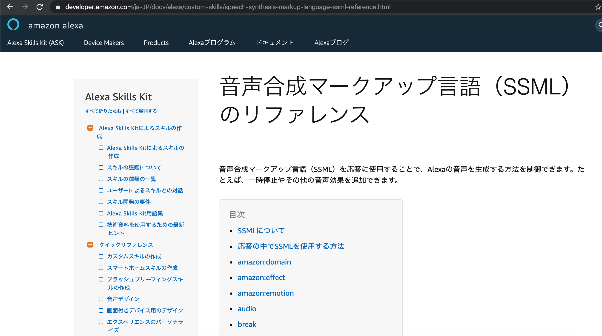

# ペルソナを設定してパーソナライズされたスキル開発をしてみる
”あんなスキルがあったらうれしい”、”こんなスキルが作れたら楽しそう” Voiceflowでは、思いついたらすぐにスキル開発を始めることができます。  
でも、はやる気持ちを少しおさえて、”どんな人が使うのか”、”スキルを使ったらどううれしいのか”ということを少し考えた後で作り始めてはどうでしょうか。

## スキルを作るにあたり、何を優先するか？
VoiceUIは、スマートフォンやパソコンの画面のような、誰もが見ただけで直感的に分かるようなインターフェースは備えていません。  
ラジオボタンやプルダウンメニューのようなグラフィカルなインターフェース、マウス操作・キーボード操作相当の入力デバイスで行っていたことを音声で行う必要があります。  
また、検索結果を画面に表示するように、応答内容を音声で伝える必要があります。 

そんな奥の深いVoiceUIのスキルをノーガード戦法で作るのは玉砕の確率が高いので、一度っっx

既にスキルのアイデアがあるという前提で、

これまでと異なりかなり考えることが多いと思います。
・ 使う人が満足できる(と思われる)台本を用意
・ その台本にあるセリフを話すように誘導してあげる仕掛け
・ 音声操作が効果的（楽しい、ラクなども含め）

その仕掛けを考える上で、
公開、マネタイズ、技術検証など、スキルを作る人によって優先するものが変わりますが、僕は使う人にとって。っっx  

ここでは、自分や子どもなど使う人へのパーソナライズを目的にしたいと思います。  
したがって、公開やマネタイズを考慮しません。

1. IN:VoiceUI - OUT：VoiceUI
1. IN:VoiceUI - OUT：デバイス
1. OUT:デバイス - IN：VoiceUI

## パーソナライズとは

> パーソナライゼーション（英: personalization）は、パーソナライズ（personalize）という動詞の名詞形であり、「何かを個々人向けにカスタマイズすること」を意味する。  
[wikipediaより](https://ja.wikipedia.org/wiki/%E3%83%91%E3%83%BC%E3%82%BD%E3%83%8A%E3%83%A9%E3%82%A4%E3%82%BC%E3%83%BC%E3%82%B7%E3%83%A7%E3%83%B3)

つまりは、使う人（ユーザー）に特化する。ということです。  
ユーザーが、スキルを親しみを持ってつかえるように、ユーザーの情報などを使い工夫してスキルを作ります。  
そのためには、ユーザーのペルソナの設定が不可欠です。

あまり深く考える必要はありません。  
フットワーク軽くスキル開発できるのがVoiceflowの強みですので、「ある人専用のスキルを作るのね」くらいで良いです。

## ペルソナとは

> ペルソナとは、企業が提供する製品・サービスにとって、最も重要で象徴的なユーザモデルのことで、ペルソナをベースにすることで、ユーザに強い影響を与えるツールのプラン・デザインが実現できる。  
[wikipediaより](https://ja.wikipedia.org/wiki/%E3%83%9A%E3%83%AB%E3%82%BD%E3%83%8A%E3%83%87%E3%82%B6%E3%82%A4%E3%83%B3)

つまりは、サービスにとって最も典型的なユーザー像のことです。  
ユーザー像を明確にして、そこからサービスをフィットさせていきます。

あまり深く考える必要はありません。  
専門的なことを知らずにスキル開発できるのがVoiceflowの強みですので、「ある人専用のスキルを作るために、ある人がどんな人か特徴を書くのね」くらいで良いです。

ペルソナを設定しておくことのメリットとして、次の３つがあります。

> * 担当者間で、共通した人物像を形成できる
> * ユーザー視点の精度を高めることができる
> * 時間、コストの削減ができる  
[ferretより](https://ferret-plus.com/8116)

１つ目は、Voiceflowのコラボレーション機能を使う場合など、複数人で開発する場合に実感できると思います。  
２つ目は、まさにパーソナライズのことで、よりユーザーに寄り添える内容となることを考えやすくなるということです。  
３つ目は、いそがばまわれや備えあれば憂いなし的なことで、準備をしておけば当初作ろうと考えていたものから大きくブレないということです。  

ここでは、２つ目を掘り下げていきます。

## ユーザーのペルソナを設定してスキルを作る
それでは、「小学校の子どもが時間割を確認するスキル」を考えてみます。

二人の子がいる家庭を想像してください。  
ユーザーは、二人の子どもですが、ひとつのスキルで二人が満足できるかは分かりません。  
それぞれ、ペルソナを設定して、二人の子にとって求められるスキルを考えてみましょう。

### ペルソナの設定
まず、それぞれについてペルソナを設定します。

#### 長女の場合
|名前|ありす|
|:---|:---|
|年齢|９歳（もうすぐ小学校四年生）|
|性別|女|
|習い事|月・水・金１９：００からダンス|
|その他|自分で翌日の準備はできるが、少し忘れ物が多い|

長女は、自分で次の日の時間割ができますがミスが多いようです。  
したがって、「準備ができた後に、確認をしてあげる」必要がありそうです。

#### 次女の場合
|名前|すず|
|:---|:---|
|年齢|６歳（もうすぐ小学校一年生）|
|性別|女|
|習い事|火・木１６：００からピアノ|
|その他|自分では翌日の準備はできない|

次女は、自分で準備をすることが難しいので、「一緒に準備を進めてあげる」ことが望まれそうです。

### UIの組み合わせ
VoiceUIだからといって入力も出力も音声にする必要はありません。  
既存のUIと組み合わせることも可能なので、ユーザーの体験向上に一番効果の高いものを選択しましょう。

|タイプ|INPUT|OUTPUT|
|:---:|:---:|:---:|
|A|音声|音声|
|B|音声|デバイス|
|C|デバイス|音声|

このスキルを使う子供たちは、ランドセルを見たり学校から配布された時間割を見たりと両手や目が塞がっているので、入出力ともに音声のタイプAで考えていきます。

### 会話を考える
ペルソナを設定したことで、長女と次女で会話や内容を変える必要があることが分かるかと思います。  
これは、ユーザーがどのような人なのかを意識して、それぞれの状況や抱えている課題が異なることを考慮した結果、つまりパーソナライズに向かっているということです。  
それぞれの設定したペルソナを元に、会話を考えていきます。

#### 長女の場合
長女は、自分で翌日の準備ができるので、準備したものを長女に発話させ、AlexaがOK/NGを判定するようにしました。  
自分で回答をするためには、自分で翌日の時間割が頭に入っていないといけません。  
クイズ形式で、Alexaに合否を判定してもらうこと正解が楽しくなっていくことを狙います。

1. 長女　:アレクサ、「ありすの時間割」を開いて
1. Alexa:こんにちは、ありす。これから一緒に時間割を確認しましょう。
1. Alexa:一時間目の授業を教えてください。
1. 長女　:国語
1. Alexa:正解!
1. Alexa:二時間目の授業を教えてください。
1. 長女　:算数
1. Alexa:正解!
1. ... (上記のようにすべての時間割を行う)
1. Alexa:明日も頑張りましょう。

#### 次女の場合
次女は、自分で準備ができるようになってほしいので、Alexaが確認し、次女ができた/できないを答えるようにしました。  
こちらも、自分で準備することが楽しくなっていくことを狙います。

1. 次女　:アレクサ、「すずの時間割」を開いて
1. Alexa:こんにちは、すず。これから一緒に時間割を確認しましょう。
1. Alexa:一時間目の授業は、国語です。準備はできましたか？
1. 次女　:できた
1. Alexa:二時間目の授業は、算数です。準備はできましたか？
1. 次女　:できた
1. ... (上記のようにすべての時間割を行う)
1. Alexa:よくできました。明日も頑張りましょう。

## より、エンゲージメントをあげるために
たったこれだけでも、その子専用のスキルになっていますが、もっとエンゲージメントをあげてみましょう。  
ここからは、ここからは次女のスキルをベースに付け加えていきます。

### 同じ意味の言葉をまとめる
スロット

### 使われる日付、時間を気にする
スキルが使われる日付から曜日を求めたり、時間を求めることができます。  
上記が分かると、子どもたちの生活リズムに合わせた会話を行うことができるようになります。

https://forum.voiceflow.com/t/getting-the-users-time-zone-in-your-skill/314

1. 次女　:アレクサ、「すずの時間割」を開いて
1. Alexa:[昼間]こんにちは。　[夜]こんばんは。
1. Alexa:すず。これから一緒に時間割を確認しましょう。
1. Alexa:一時間目の授業は、国語です。準備はできましたか？
1. 次女　:できた
1. Alexa:二時間目の授業は、算数です。準備はできましたか？
1. 次女　:できた
1. ... （上記のようにすべての時間割を行う）
1. Alexa:よくできました。
1. Alexa:[月・水]明日はピアノもありますね。
1. Alexa:明日も頑張りましょう。

### 音を鳴らす
クイズ番組の”正解／不正解の音”のように、効果的に音を鳴らすことでユーザーの体験を向上させることができます。効果音というやつです。  
Voiceflowでは、2つの方法で効果音を鳴らすことができます。  
ひとつは、自身で音声ファイルをアップロードし鳴らす方法、もうひとつは、あらかじめ用意されている音声ファイルを鳴らす方法です。  
ここでは、あらかじめ用意されている音声ファイルを使って効果音を鳴らします。  

あらかじめ用意されている効果音は、AmazonおよびGoogleがサウンドライブラリとして、それぞれAmazon Alexa用、Googleアシスタント用に用意されています。  

[Alexa Skills Kitサウンドライブラリ](https://developer.amazon.com/ja-JP/docs/alexa/custom-skills/ask-soundlibrary.html)

[Google Assistant Sound Library](https://developers.google.com/assistant/tools/sound-library)

1. 次女　:アレクサ、「すずの時間割」を開いて
1. Alexa:[初回のみ]初めまして。
1. Alexa:[初回以外][昼間]こんにちは。　[夜]こんばんは。
1. Alexa:すず。これから一緒に時間割を確認しましょう。
1. Alexa:一時間目の授業は、国語です。準備はできましたか？
1. 次女　:できた
1. Alexa:[サウンド]拍手
1. Alexa:二時間目の授業は、算数です。準備はできましたか？
1. 次女　:できた
1. Alexa:[サウンド]ピンポーン
1. ... （上記のようにすべての時間割を行う）
1. Alexa:よくできました。
1. Alexa:[月・水]明日はピアノもありますね。
1. Alexa:明日も頑張りましょう。

### Alexaのセリフに抑揚や強弱をつける

[音声合成マークアップ言語（SSML）](https://developer.amazon.com/ja-JP/docs/alexa/custom-skills/speech-synthesis-markup-language-ssml-reference.html)

## おわりに
Voiceflowには、ほかにもさまざまな機能があります。  
スキルを繰り返しブラッシュアップして、長く使ってもらえる
