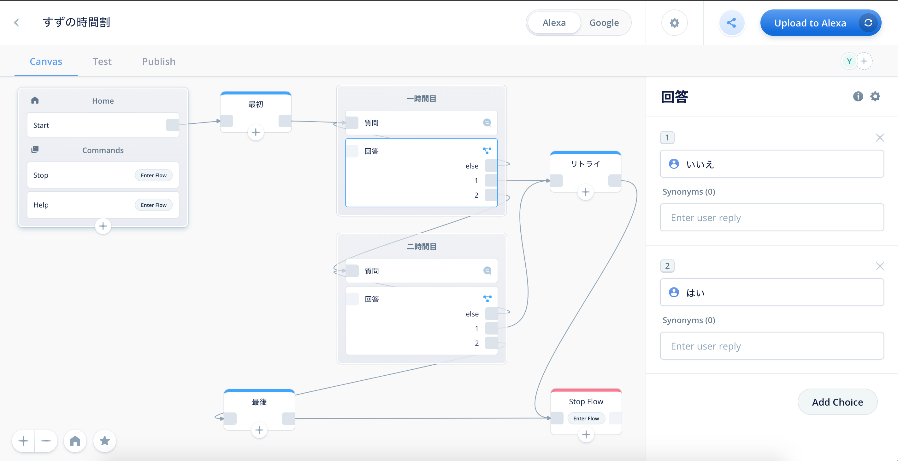
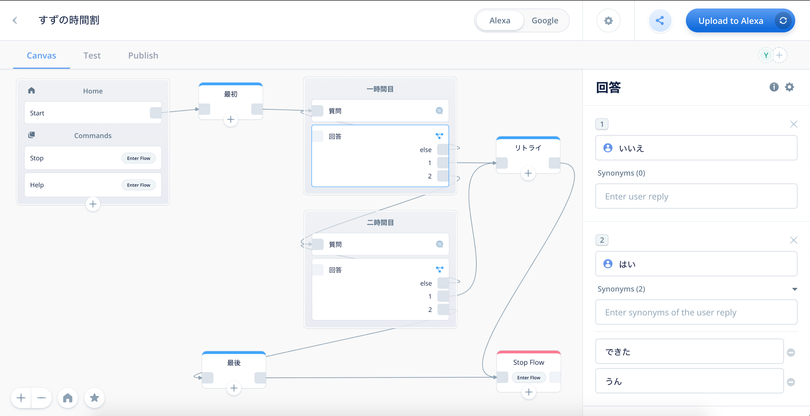
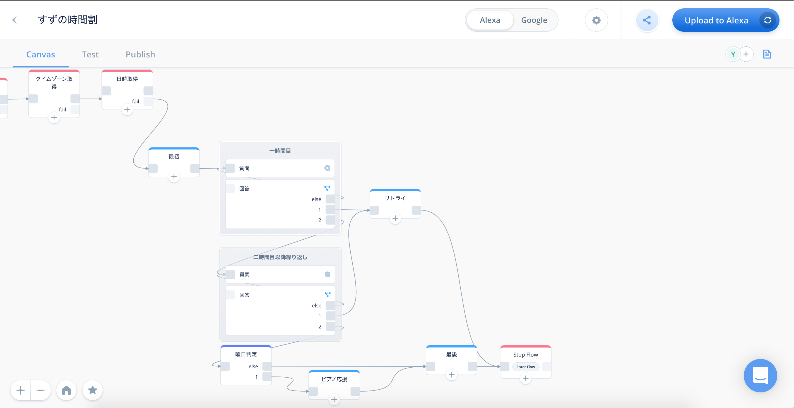
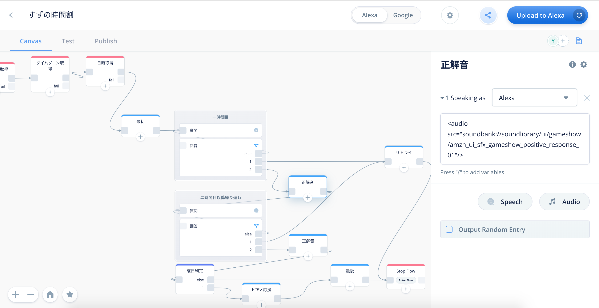
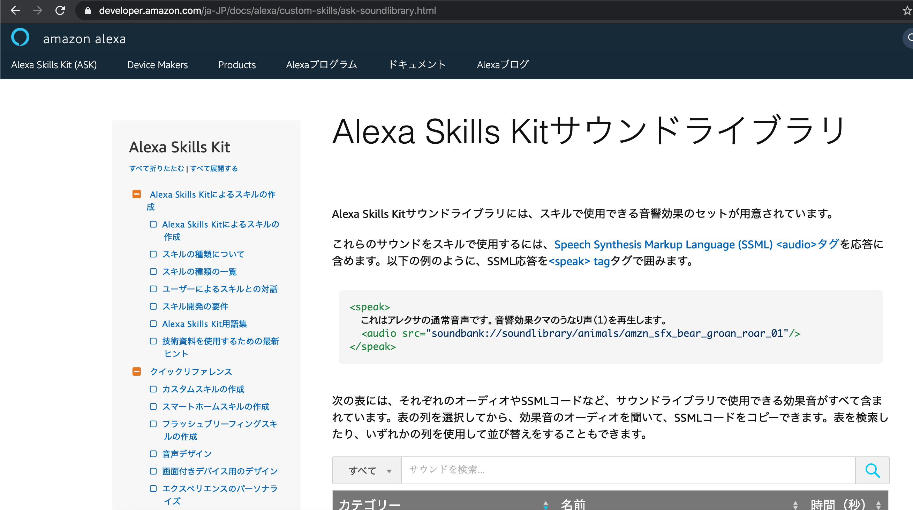
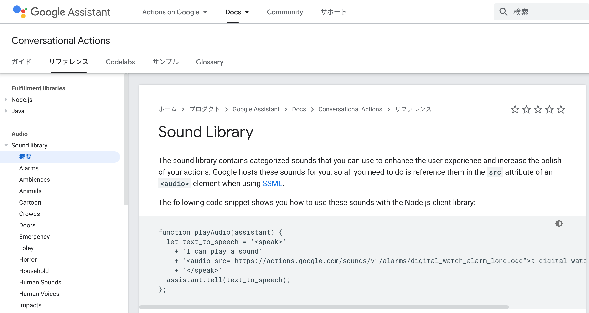

# エンゲージメントを考えてみよう
## はじめに
”あんなスキルがあったらうれしい”、”こんなスキルが作れたら楽しそう” Voiceflowでは、思いついたらすぐにスキル開発を始めることができます。  
せっかく作るのであれば、使う人が喜んでくれたり使いやすいスキルを作りたいですよね。

本章では、はやる気持ちを少し抑えて、愛着を持ってもらえるスキルを作るにはどうしたらよいか？を考えてみたいと思います。

### 対象読者
本章が対象とするのは下記の方です。

- ちょっとだけVoiceflowをさわったことがある方
- VUIアシスタントとの会話が素っ気なく感じる方

## エンゲージメントとは
業界によって様々な解釈があるようですが、ざっくり言うと親近感・愛着・思い入れといった「繋がり」のことです。

エンゲージメントを高めるには、”スキルを使う人はどんな人か”、”スキルを使ったら何が嬉しいのか”を考えてたうえでスキルを作る必要があります。
ユーザーを深く知る（具体的に定義する）ために、「ペルソナ」というツールを使います。

## ペルソナとは
サービスにとって最も典型的なユーザー像のことです。  
ユーザー像を具体的にして、ユーザーにフィットさせることで、より満足度の高いサービスを提供できるようになります。  
あまり深く考える必要はありません。  
専門的なことを知らずにスキル開発できるのがVoiceflowの強みですので、「ある人専用のスキルを作るために、ある人がどんな人か特徴をあげる」という捉え方で良いです。

ペルソナを設定しておくメリットとして、次の３つがあります。
> * 担当者間で、共通した人物像を形成できる
> * ユーザー視点の精度を高めることができる
> * 時間、コストの削減ができる 
> _「今さら聞けない「ペルソナ」とは。意味やマーケティング上での活用方法について」ferretより。URL: https://ferret-plus.com/8116_

## スキル開発
それでは、エンゲージメントを考えながらスキル開発をしていきましょう。  

例えば「小学校の子どもが時間割を確認するスキル」を思いついたとします。  
”小学生”では抽象的なので、もっとユーザーに寄せていきます。

### ペルソナの設定
ペルソナの設定をしてみましょう。  
具体的なユーザーが決まっていれば、そのユーザーをイメージして整理をします。  
何を整理すればよいのか疑問かと思いますが、まずは分かっていることを並べるだけでもよいと思います。

ここでは、同じテーマのスキルであっても、ペルソナを設定することで求められるものに違いが出ることが分かるように、我が子二人のペルソナを書いてみます。

これをベースにどんな時間割スキルがよいかを考えていくと

- 長女は、もうすぐ小学四年生であることから、自分で翌日の準備ができることが想像できるので「準備ができた後に、確認をしてあげる」
- 次女は、まだ小学一年生であることから、一人で翌日の準備をすることが難しいので「一緒に準備を進めてあげる」

が喜ばれそうです。

たったこれだけを整理するだけで、同じ小学生を対象にしたスキルであっても、求められるものに違い出ることがわかります。

### UIの確認
VoiceUIだからといって入力も出力も音声にする必要はありません。  
既存のUIと組み合わせることも可能なので、ユーザーの体験向上に一番効果の高いものを選択しましょう。  
ユーザーの利用シーンをイメージして、ざっくり下記の表のタイプから作ろうとしているスキルのタイプを考えておくとよいです。

例題のスキルを使う子供たちの利用シーンは下記ですので、入出力ともに音声のタイプAが適していると考えます。
- 学校から配布された時間割を見るため視線を使わないことが望ましい
- 教科書を持ったりランドセルの中をあさるため両手が使えない

### 会話フローと内容
ペルソナを設定したことで、長女と次女で会話や内容を変える必要があることが分かるかと思います。  
それぞれのペルソナを元に、会話フローと内容を考えます。

#### 長女の場合
長女は、自分で翌日の準備ができるので、準備したものを長女に発話させ、alexaがOK/NGを判定するようにしました。  
自分で回答をするためには、自分で翌日の時間割が頭に入っていないといけません。  
クイズ形式で、alexaに合否を判定してもらうこと正解が楽しくなっていくことを狙います。

#### 次女の場合
次女は、自分で準備ができるようになってほしいので、alexaが確認し、次女ができた/できないを答えるようにしました。  
こちらも、自分で準備することが楽しくなっていくことを狙います。

### スキル作成
どのようなユーザーなのかを意識することにより、それぞれの状況や抱えている課題を考慮した会話の内容となります。  
長女と次女では会話のフローは同じですが、内容がそれぞれに特化した内容になっています。つまりパーソナライズに向かっているということです。  
この会話フローがスキルの設計書になります。この設計書に沿ってVoiceflowでスキルを作ってみましょう。
「Speak」ブロックと「Choice」ブロックのみで作れます。

例題では、次女の会話フローからスキルを作ります。

## よりエンゲージメントをあげるために
たったこれだけでも、既にその子専用のスキルになっていますが、もっとエンゲージメントをあげてみましょう。  

### シノニム
同義語を登録します。  
通常の会話では「YES」と「はい」などを同義語として無意識に扱っていると思います。しかし、作ったスキルは、ユーザーが発した言葉が期待したものと同義かどうかを自動判別してくれません。
スキルを使う中で、同義のものを異なるものと判断されると、改めて言い直すなどストレスを感じてしまいます。  
そこで、ユーザーが言いそうな同義語（言い間違えも含めて）を登録し、スムーズな会話となるようにします。

例題では、準備ができたかを回答している「できました」に同義語を登録していきます。

### 日時の情報
スキルが使われる日付から曜日を求めたり、時間を求めることができます。  
上記ができると、次のような使い方もできるようになり、ユーザーの予定に合わせた会話が可能になります。
- 曜日や時間帯毎にメッセージを変える
- 誕生日など特別な日にメッセージを変える

例題では、習いごとの前日は、ピアノを応援するメッセージを追加で言うようにします。  
「code」ブロックと「if」ブロックを使います。  
「code」ブロックの使い方は、Voiceflow公式のフォーラムに丁寧に乗っていますので参考にしてください。  
https://forum.voiceflow.com/t/getting-the-users-time-zone-in-your-skill/314

### SSML
ベンダー毎にサポートされているタグが異なったり、独自のタグがある
- alexa
- google

#### サウンドライブラリ
クイズ番組の”正解／不正解の音”のように、効果的に音を鳴らすことでユーザーの体験を向上させることができます。いわゆる効果音というものです。  
Voiceflowでは、2つの方法で効果音を鳴らすことができます。  
ひとつは、自身で音声ファイルをアップロードし鳴らす方法、もうひとつは、ベンダーが用意している音声ファイルを鳴らす方法です。  
ベンダーが用意している音声ファイルとは、それぞれのベンダーがサウンドライブラリとしてスキル用に公開しているもので自由に使うことができます。

例題では、ベンダーが用意している音声ファイルを使って効果音を鳴らします。

##### Alexa Skills Kitサウンドライブラリ
https://developer.amazon.com/ja-JP/docs/alexa/custom-skills/ask-soundlibrary.html

##### Google Assistant Sound Library
https://developers.google.com/assistant/tools/sound-library

#### Speechcons

例題では、最初のあいさつ「こんにちは」をSpeechconを使って発話させます。

## おわりに
他にもVoiceflowの機能を使うことで更にエンゲージメントを進めることが可能です。
・Googleスプレッドシートから時間割情報を取得する
・時間割が完了したら親にメールやSMS等で通知する
・
本格的にパーソナライズする場合、もっと様々なことを考える必要があります。
Blocksメニューのuserカテゴリ「user info」を使うと更に幅広い情報が使えるようになります。
