# Voiceflowの始め方
Voiceflowを使ってみたいという初心者の方向けに、「Voiceflowとは何か」、「Voiceflowを使った音声アプリケーションの作り方の流れ」を学べる章になっています。読みながら実際に手を動かし感触を得ていただければ幸いです。

## はじめに

### Voiceflowとは
ノンコーディングで音声アプリケーション（Alexaスキル、Googleアクションなど）の設計・作成ができるサービスです。視覚的に分かりやすいビジュアルプログラミングで初心者の方でも簡単に使い始めることができます。  
[https://www.voiceflow.com/](https://www.voiceflow.com/)

なお、2020/1/1時点、Voiceflowの利用者は50ヵ国以上、21,000人以上に拡大しており、世界的に使われています。  

### プロダクトについて
３種類のプロダクトが用意されています。それそぞれのプロダクトの内容を下記で説明します。

- Alexa Skills  
Alexaスキルをノンコーディングで作成できます。また、世界のAlexaスキルの5%がVoiceflowから作られています。（Alexaスキルとは、Amazonが開発したAIアシスタント「Alexa（アレクサ）」で利用できる機能やサービスのことです。）
- Google Actions  
Googleアクションをノンコーディングで作成できます。（Googleアクションとは、Googleが開発したAIアシスタント「Google Assistant（アシスタント）」で利用できる機能やサービスのことです。）
- IVR（BETA）  
最新のIVRシステムをノンコーディングで作成できます。最新のIVRテクノロジは、設計、プロトタイプ作成、繰り返しが容易てでなければなりません。お客様が求めているものを迅速 に見つけ、運用コストを削減し、カスタマー・ロイヤルティを向上させるために役立ちます。Voiceflowを使えば、より速く自分のものを作ることができます。

### 料金プランについて
４種類のプランが用意されており月単位での契約と年単位での契約が可能です。個人で利用する分には無料の「BASIC」プランで十分開発できます。それぞれのプランの内容を下記で説明します。（2020/1/1時点、料金プランはこれまで何度か改定されてきました）

- BASIC  
無料で無制限にプロジェクトを作ることができ、すべてのコア機能も使うことができます。
- PROFESSIONAL  
最大3人まで音声アプリケーションを共同で開発できます。また、無制限にバックアップができ、優先的にサポートを受けられます。
- TEAM  
PROFESSIONALの機能に加えて、最大10人まで音声アプリケーションを共同で開発できます。さらに専用のサポートが付いています。
- ENTERPRISE  
より大規模な要件が必要になった時、選択するプランです。詳細に関しては問い合わせが必要になります。

[https://www.voiceflow.com/pricing](https://www.voiceflow.com/pricing)  
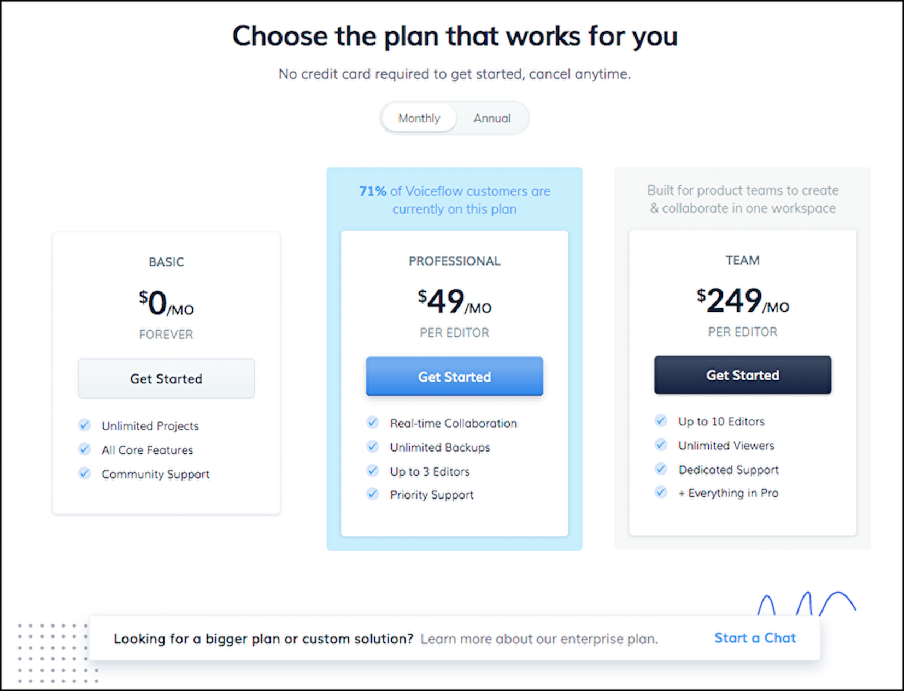

### ドキュメントについて
ドキュメント類は動画で分かりやすく使い方が解説されています。下記にてURLを記載しますので、それぞれの「Get started」から参考にしてみてください。なお、動画で解説されているものは後述の【動画解説】にまとまっています。

- ドキュメント  
[https://docs.voiceflow.com/home/get-started-with-voiceflow/](https://docs.voiceflow.com/home/get-started-with-voiceflow)

  

- チュートリアル  
[https://learn.voiceflow.com/en/collections/1499932-learn-the-basics#getting-started](https://learn.voiceflow.com/en/collections/1499932-learn-the-basics#getting-started)

#### 【動画解説】
[https://www.youtube.com/channel/UCbqUIYQ7J2rS6C_nk4cNTxQ](https://www.youtube.com/channel/UCbqUIYQ7J2rS6C_nk4cNTxQ)@ {}

また、下記で意見交換なども活発に行われていますので、合わせてご活用ください。

- フォーラム  
[https://forum.voiceflow.com/](https://forum.voiceflow.com/)

- Facebook  
[https://www.facebook.com/groups/voiceflowgroup/](https://www.facebook.com/groups/voiceflowgroup/)

- Voiceflow日本ユーザーグループ  
[https://www.facebook.com/groups/vfjug/](https://www.facebook.com/groups/vfjug/)

## Voiceflowの使い方の流れ
アカウントの作成方法、音声アプリケーションの作り方から動作確認までの手順を下記の順に説明します。

- アカウント作成
- 画面の説明
- 基本的なブロックの説明
- 作成手順
- 動作確認
- 次回以降のプロジェクト作成手順

### アカウント作成
下記URLを開き、右上にある「Sign Up」ボタンをクリックします。  
[https://www.voiceflow.com/](https://www.voiceflow.com/)  
サインアップには名前、メールアドレス、パスワードを入力します。
Voiceflowは「Google」と「Facebook」でソーシャルログインができますので、ご利用の方はそちらからでもサインアップできます。そのあと、いくつかのアンケートに答えていくと、利用できます。

### 画面の説明
左側のBlocksメニューにあるブロックをドラッグしながら、右側のCanvasにドロップして、音声アプリケーションを作っていきます。
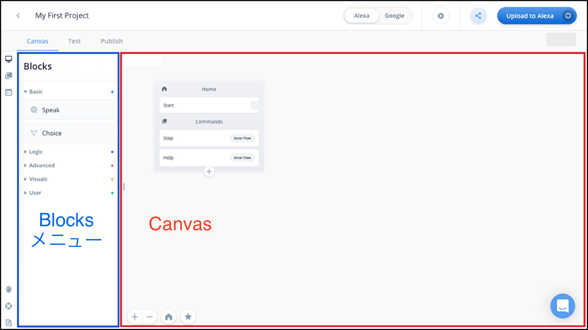

### 「Basic」機能のブロックの説明
「Basic」機能のブロックを説明します。下記２つのブロックだけでも、簡単な音声アプリケーションを作ることができます。

- Speak Block

> Speak Blockを使用すると、Alexaがさまざまな声でユーザーと会話したり、音声ファイルを再生したりします。  

[https://docs.voiceflow.com/voiceflow-documentation/untitled/speak-blockから引用](https://docs.voiceflow.com/voiceflow-documentation/untitled/speak-block)

- Choice Block

> Choice Blockにユーザーの発話と分岐を定義します。ユーザーが発話リストにある選択肢の1つを話すと、その選択肢のパスに従います。ユーザーが選択肢にないことを話すと、ELSEパスに従います。  

[https://docs.voiceflow.com/voiceflow-documentation/untitled/choice-blockから引用](https://docs.voiceflow.com/voiceflow-documentation/untitled/choice-block)

### 作成手順
それでは、作成手順を説明していきます。Speak Blockをドラッグ&ドロップし、右側にある設定画面で文章を入力します。
できたら、ブロック同士をつなげます。
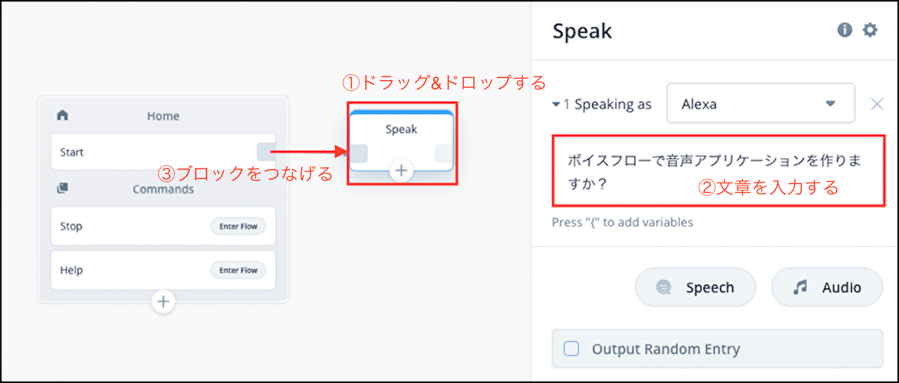

次にChoice Blockをドラッグ&ドロップし、右側にある設定画面でそれぞれ「はい」と「いいえ」を入力します。
できたら、Speak Blockとつなげます。
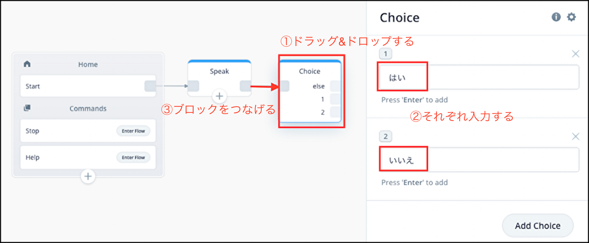

最後に２つSpeak Blockをドラッグ&ドロップし、右側にある設定画面でそれぞれ文章を入力します。
できたら、Choice Blockとつなげます。@ {}@ {}
【文章の入力例】@ {}
1. 一緒に頑張りましょう。  
2. ぜひ作ってみてください。
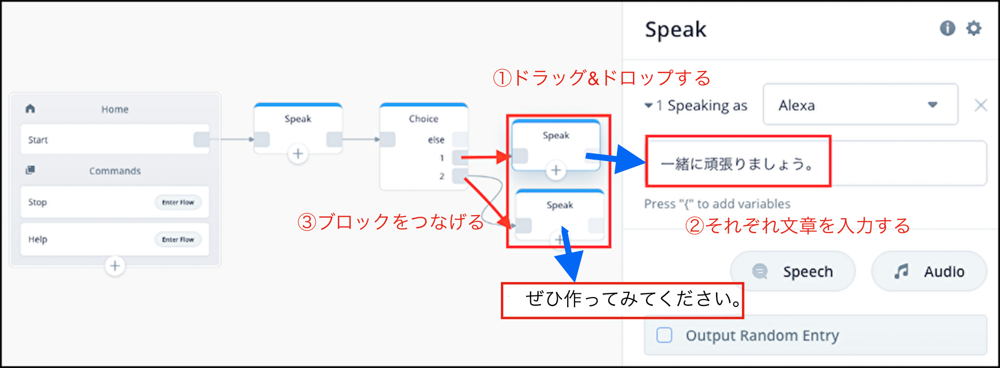
 
### 動作確認
作ったものを動かして確認しましょう。Voiceflow上で動作確認が可能です。「Testタブ」に移動して、「Start Test」ボタンをクリックします。
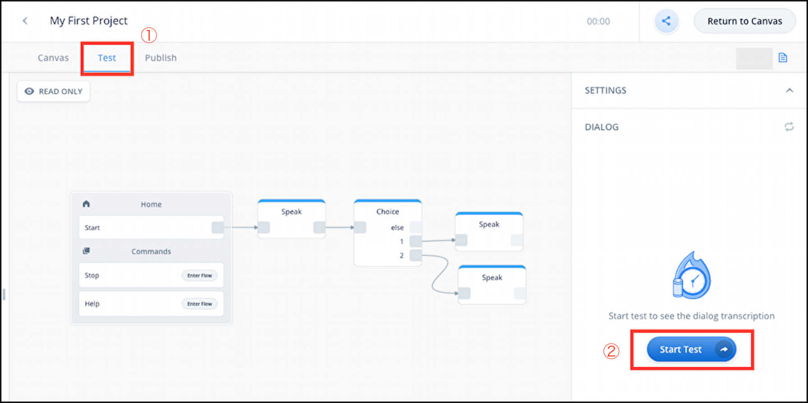

//embed[latex]{
\clearpage
//}

ユーザーが「はい」、「いいえ」のそれぞれを選んだ時、返事が異なることを確認できます。
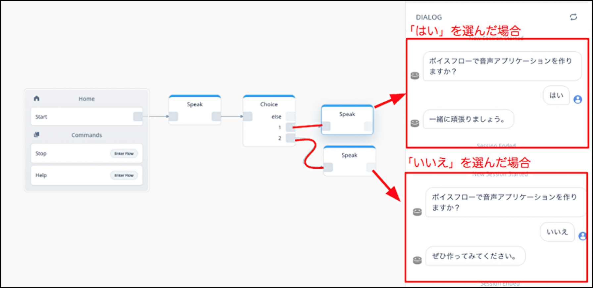

### 次回以降のプロジェクト作成手順
一覧画面に戻り、画面下にある「Create Project」から作成します。
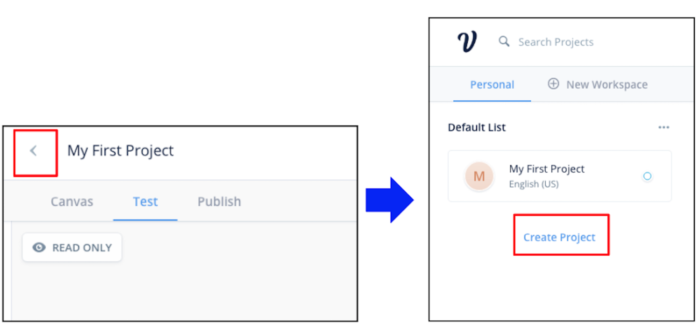

//embed[latex]{
\clearpage
//}

プロジェクト名を入力、日本語にチェックをつけて、作成します。

## アップロード
アップロードをすると、それぞれのプラットフォームで動作を確認できます。詳しくは、ほかの章で説明されています。なお、Alexaスキルは、Alexa開発アカウントが必要になります。詳しくは下記URLで説明されていますので、参考にしてください。  
[https://dev.classmethod.jp/voice-assistant/how-to-safety-create-alexa-developers-account/](https://dev.classmethod.jp/voice-assistant/how-to-safety-create-alexa-developers-account/)
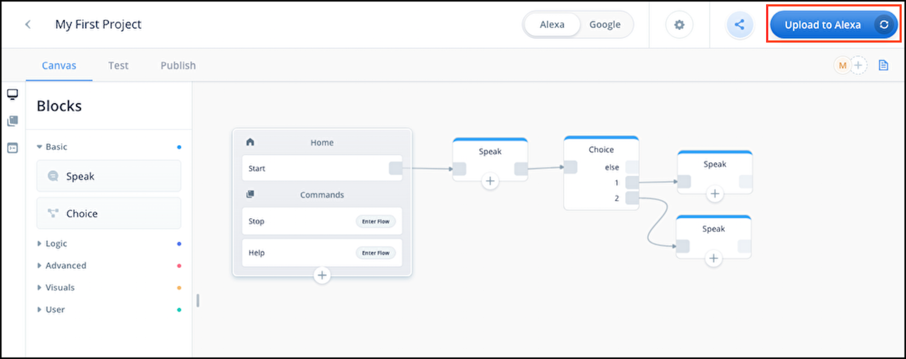

## 補足
### ブロックにつないだ線の消し方
ブロックの線を間違ってつないでしまった場合、下記２つの方法で線を消すことができます。

1. 左側にあるブロックのグレーの四角をクリック
2. 線にカーソルを合わせて、出てきたゴミ箱マークをクリック

### ブロックのコピー（削除）
同じようなブロックが必要な場合（ブロックが不要になった場合）、下記２つの方法でブロックをコピー（削除）できます。

1. コピーしたいブロックの上で右クリックして、「Copy Block」をクリックします。（ブロックを消す場合は「Delete Block」をクリックします。）そして何もない場所で右クリックして、「Paste」をクリックします。
2. コピーしたいブロックをクリックして、キーボードの「Ctrl/Command + C」を押します。そして「Ctrl/Command + V」を押します。（ブロックを消す場合は「Del」を押します。）

### 動作確認を共有
Share Testボタンをクリックして、「Share testable link」からリンクを取得します。このリンクを他人に共有すると、自分のプロジェクトを動作確認できます。
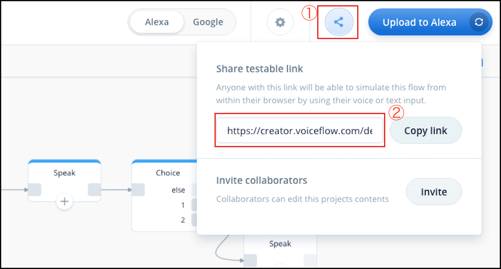

//embed[latex]{
\clearpage
//}

### プロジェクトのダウンロード  
右上にある設定ボタンをクリックして、「Downloadable link」からリンクを取得します。このリンクを他人に共有すると、自分のプロジェクトがダウンロードできます。

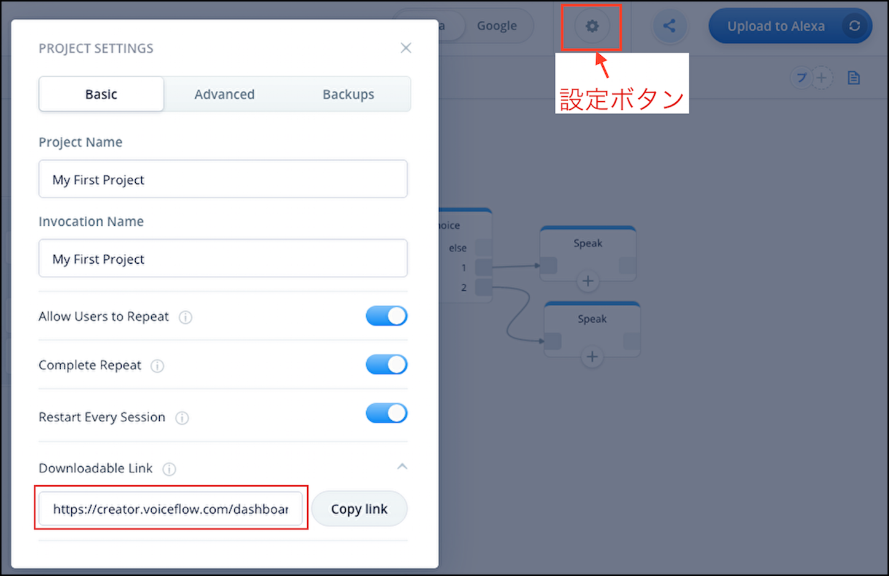  

### 知っておくと便利な設定
- プロジェクト名の変更  
右上にある設定ボタンをクリックして、「Display Name（表示名）」と「Invocation Name（呼び出し名）」を変更できます。

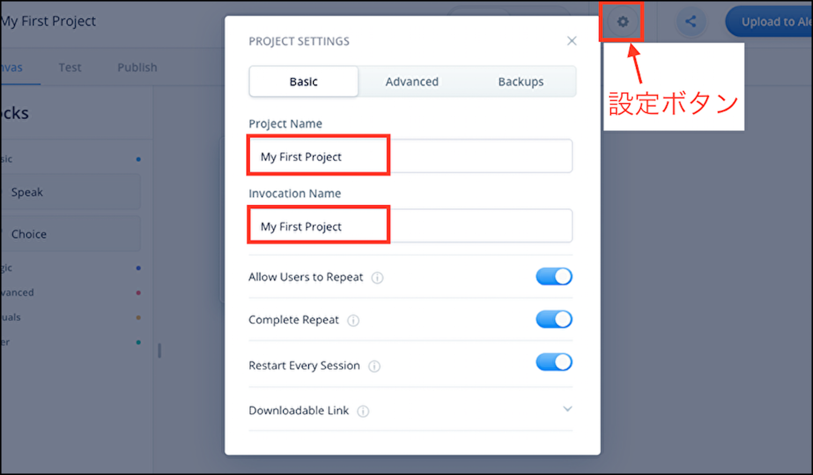  

- リンク解除  
一覧画面右上のアカウント名から「Account」を選び「Reset」をクリックします。再設定方法はアップロードする際に、正しくアカウント連携を行ってください。

### サポート機能
ドキュメントなどを見ても分からないことがあったら、右下の吹き出しからVoiceflowのメンバーに質問ができます。
英語でのやりとりとなります。時差はありますが、業務時間内ならすぐに返事がもらえます。
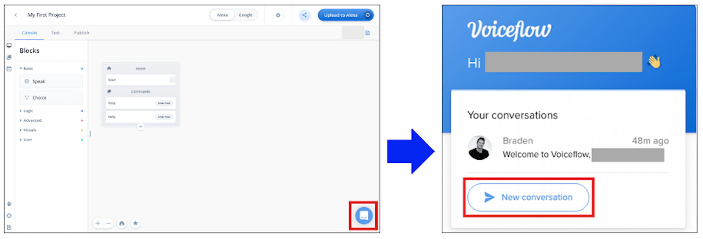

### 稼働状況
Voiceflowの稼働状況を確認できます。緑になっていれば、正常に稼働しています。問題があった際は確認してみてください。

[https://status.voiceflow.com/](https://status.voiceflow.com/)

## おわりに
Voiceflowの基本的な機能を扱ってみました、いかがでしたでしょうか。Voiceflowの機能を活用すれば、やりたいことを比較的簡単に実現できる可能性があります。ぜひ、いろいろな活用を検討してみてください、その際に本章が少しでも参考になれば幸いです。
