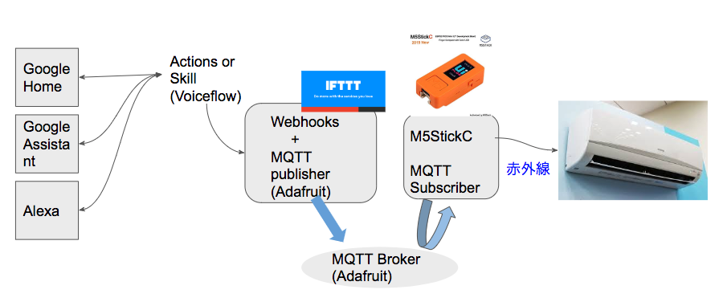
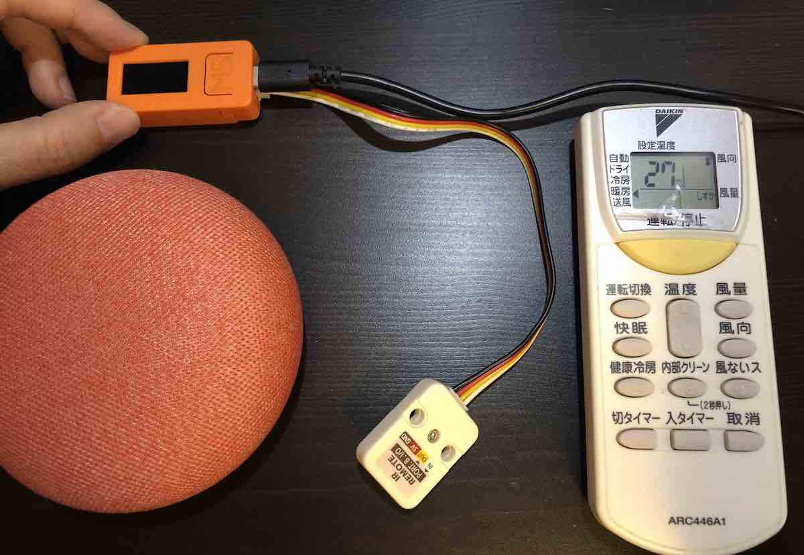

# スマートリモコンをM5StickCで自作し、Google Homeから家電を操作

## 概要

本章は、**M5StickCや電子工作に興味ある人に、「音声で操作するインタフェース」が「実はお手軽に追加できる」事を知ってもらいたくて書きました。**
VUIクラスタの人にも**軽率に電子工作沼にハマっていただきたい**ので、半田付けなどしなくても使えるケース付きの格安小型マイコンを使っております。

音声部分の開発にVoiceflowを使っており、アップロード先を変えればAmazon Echoにも対応できます。

IoTのプロトタイピングにも使えるいろんなテクを寄せ集めていますので、何かのヒントになると幸いです。

### やること

* M5StickCで自宅エアコンの赤外線リモコンを作成 
* AdafruitのMQTTブローカの設定 
* IFTTTでMQTTの簡易パブリッシャーを作る 
* VoiceflowでActions On Googleを作成 
* 全部つなげて動作確認！ 





### 開発環境

* MacBook Air（OS: 10.13.6 High Sierra）
* VSCode
* Arduino IDE 1.8.9
* Google Home mini

自分はMacを使いましたが、Windowsにも共通のツールがあります。適宜読み替えて進めてください。

### 使用した部品

* M5StickC ¥1,980　
* M5用、赤外線送受信ユニット ¥308
@<fn>{sitopp_plice}

//footnote[sitopp_plice][値段は2020年1月12日時点でのスイッチサイエンスの通販税込価格です。]



//embed[latex]{
\clearpage
//}


## 手順

## 1. M5StickCで赤外線リモコン作成

### 準備

あらかじめ、MacにArduino IDEをインストールして、M5StickCを使えるようにしておきます。

参考）

* 公式「M5StickCクイックスタート-Arduino Win」
https://docs.m5stack.com/#/ja/quick_start/m5stickc/m5stickc_quick_start_with_arduino_Windows

* 「くらつきねっと」さんの「M5StickC で開発を行うための Arduino IDE のセットアップ」
https://kuratsuki.net/2019/07/


### M5StickCで、赤外線リモコンの命令を読み込む

Mac上でArduino IDEを起動し、M5StickCをMacにUSB Type-Cケーブルで接続します。

* 「ツール」→「ボード」→「M5StickC」を選択します。
* 「ツール」→「シリアルポート」→表示された複数の選択肢野中から、「usbserial」の文字が入っているものを選択します。@<fn>{sitopp_m5stick_lost}
//footnote[sitopp_m5stick_lost][usbserialのポートが出てこない場合、M5StickCに付属のUSBケーブルを使うと解決します。]


* Arduino IDEの「ツール」→「ライブラリを管理」→「IRremoteESP8266」と入力し、表示されたライブラリをインストールします。
* 「ファイル」→「スケッチ例」→「IRremoteESP8266」→「IRrecvDumpV2」を開きます。
* 「ファイル」→「新規ファイル」でスケッチエディタを開き、上で開いた「IRrecvDumpV2」を全文コピーして貼り付け、以下の一行だけ書き換えます。

```
const uint16_t kRecvPin = 14;
↓
const uint16_t kRecvPin = 22;
```

* 「→」をクリックして、M5StickCに書き込みします。

以下のメッセージが出たら、インストールは完了です。

```
Leaving...
Hard resetting via RTS pin...
```


* 「ツール」→シリアルモニタを開きます。ここでシリアル出力したメッセージが閲覧できるようになります。
「IRrecvDumpV2 is now running and waiting for IR input on Pin 22」というメッセージが出ていたら、ちゃんとシリアル出力できています。

では、エアコンなどのリモコンを構えて、赤外線ユニットの20〜30センチ以内でリモコンを操作してみましょう。

オンとオフの2回、操作したところです。
ここに画像：s021.png。


シリアルモニタにコードが出力されたら、全文コピーして、メモ帳などに保存しておきます。


### 赤外線命令の切り出し

メーカごとにやり方が違うので、少し面倒です。
この本ではDaikinのエアコンでのやり方について説明します。


Arduino IDEの「ファイル」→「スケッチ例」→「IRremoteESP8266」→「IRsendDemo」を開きます。

「ファイル」→「新規ファイル」でスケッチエディタを開き、上で開いた「IRsendDemo」を全文コピーして貼り付け、以下を書き換えます。

```
const uint16_t kIrLed = 4;
↓
const uint16_t kIrLed = 21;

```


### MQTTのサブスクライバ

knolleary/pubsubclient を取り込みます。

https://github.com/knolleary/pubsubclient
から clone or Downloadボタンを押してダウンロードします。

スケッチ→ライブラリをインクルード→.zip形式のライブラリをインストール。


## 2. AdafruitのMQTTブローカの設定

### AdafruitでMQTTブローカーの登録

Adafruit（エイダフルート）でアカウントを作成。

https://ifttt.com/adafruit

ダッシュボードを作成。
https://io.adafruit.com/
にアクセスし、＞Actions＞Create a New Dashboard＞
Name：M5 Devなど、任意の名前
Description：開発用など、任意の説明
＞create

Feeds＞ View All＞ Actions＞ Create a new feed＞

Name：sitoppM5Dev
Description：開発用です

出来上がった「sitoppM5Dev」をクリックすると、ダッシュボードがひらく。


AdafruitのMQTT情報はこちら
https://io.adafruit.com/api/docs/mqtt.html#mqtt-connection-details


### IFTTTでWebhooksとMQTTを繋げる


「Connect」をクリックすると、Adfruitのサイトに飛ぶので、ログインしてなければログインしてから、Authorizeをクリック。

右上のユーザーメニュー＞「Create」＞「This」＞Search serviceの記入欄に「Webhooks」と入力してエンター＞Webhooksのパネルをクリック＞「Receive a web requesbt」のパネルをクリック＞ 「Event name」に好きな名前を入力。「M5_MQTT」など。＞「Create trigger」

次に「That」をクリック＞Search serviceの記入欄に「Adafruit」と入力してエンター＞Send data to Adafruit IO＞
Feed name：選択不可

Data to save ：右下の「Add Ingredient」」をクリックし、「EventName」を選択＞
Create action


## VoiceflowでAlexa Skill / Actions On Googleを作成

Integrationsブロック

Request URL
put : https://io.adafruit.com/sitopp/feeds/onoff

Headers: 
Content-Type
Value: application/json


Body:
「Raw」を選択して、
{
  "value1":"aircon",
  "value2":"on",
  "value3":"t7d=ClVt"
}


## Google HomeからM5StickへMQTTでメッセージ送信
## 導通確認


{ 
  "value1" : "aircon", 
  "value2" : "on", 
  "value3" : "t7d=ClVt" 
}


