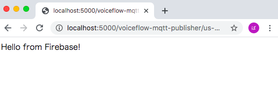

# M5StickCで赤外線リモコンを作り、AlexaやGoogle Homeから家電を操作する。

Nature remo　Miniなどのスマートハブは便利ですが、買うと結構高いので、使わなくなったM5StickCを使って自作してみます。M5Stack用の赤外線送受信ユニット（308円）だけは買い足しました。
IoTに使えるいろんなテクを寄せ集めていますので、何かのヒントになると幸いです。

## やること 

* M5StickCで赤外線リモコン作成
* FirebaseにNode.jsをホスティング
* VoiceflowでActions On Googleを作成
* Google HomeからM5StickへMQTTでメッセージ送信
* 導通確認


## 使用した機材やアカウント

* 機材：

* * M5StickC ¥1980
* * M5StickCに付属のUSB Type-Cケーブル（注1）
* * M5用、赤外線送受信ユニット ¥308
* * MacBook Air（OS: OS 10.13.6 High Sierra）
* * VSCode
* * Arduino IDE 1.8.9
* * スマートフォン、GoogleアシスタントApp
（※ Google アシスタントの代わりに、Amazon EchoやGoogle Home / Nestも使えます。）

注1　MacとM5StickCをつなぐ時、M5StickCに付属のUSB Type-Cケーブルを使わないと認識しないことが多いので、なくさないよう大切に保管しておきましょう。


* アカウント：

 * * Googleアカウント
 * * Firebaseアカウント
 * * Voiceflowアカウント

ではさっそくやっていきます。

## M5StickCで赤外線リモコン作成

あらかじめ、Arduino IDEでM5StickCを使えるようにしておきます。
参考：https://〜

M5StickCにM5Stack赤外線送受信ユニットをさします。Groveケーブルが若干きついので、「やっぱM5Stackじゃないとダメかな」と言う考えが一瞬頭をよぎりますが、ちゃんと入ります。

Arduino IDEを起動し、M5StickCをUSB Type-Cケーブルで接続します。

Arduino IDEの「ツール」→「ライブラリを管理」→「IRremoteESP8266」と入力し、表示されたライブラリをインストールします。

Arduino IDEの「ファイル」→「スケッチ例」→「IRremoteESP8266」→「IRrecvDumpV2」を開きます。

「ファイル」→「新規ファイル」でスケッチエディタを開き、上で開いた「IRrecvDumpV2」を全文コピーして貼り付け、
以下の一行だけ書き換えます。

```
const uint16_t kRecvPin = 14;
↓
const uint16_t kRecvPin = 33;
```

daikinのコードが取れたら、出力してみます。


### MQTTのサブスクライバ

knolleary/pubsubclient を取り込みます。

https://github.com/knolleary/pubsubclient
から clone or Downloadボタンを押してダウンロードします。

スケッチ→ライブラリをインクルード→.zip形式のライブラリをインストール。


## FirebaseにNode.jsをホスティング


Firebase
https://firebase.google.com/
アカウントを持っていなければ作成しておきます。

公式のリファレンス 
https://firebase.google.com/docs/cli?hl=ja を参照しながら、
プロジェクト作成をしていきます。
以下はコマンドの抜粋です。


* Macローカルのバージョン確認

```
node --version
→8以上であること
npm --version
→入っていればOK、自分の環境で6.9.0でした。動かなければ最新版にあげてください。

npm install -g firebase-tools
cd ~
mkdir workspace
cd workspace
mkdir firebase
cd firebase
firebase login
firebase init

Which Firebase CLI features do you want to set up〜
→ Function と Hostingを選択してエンター。

First, let's associate this project diary with a Firebase project.〜
→ Create a new project」を選択してエンター。

Please specify a unique project id (warning: cannot be modified 〜
→プロジェクトIDを決めて入力。
例）voiceflow-mqtt-publisher

What would you like to call your project? (defaults to your project ID) 
→特に入力せずにエンター。

What language would you like to use to write Cloud Functions? 
→ JavaScript

Do you want to use ESLint to catch probable bugs and enforce style?
→y

Do you want to install dependencies with npm now?
→y

What do you want to use as your public directory? (public)
→ エンター

Configure as a single-page app (rewrite all urls to /index.html)? 
→N
```

プロジェクトが作成できたら、npmパッケージをインストールします。

```
cd ~/workspace/firebase/functions
npm install mqtt --save
```

この「functions」ディレクトリ以下にファイル一式が生成されます。
VSCodeを起動して、index.jsファイルを開き、中身を編集しましょう。
「mynameeeeeee/voiceflow/mqtt/infrared」の部分が自分専用となるよう、
「mynameeeeeee」の所を、自分の名前など、わかりやすいものに変更してください。
もし他人が宣言した名前とかぶっていた場合、エラーは出ないで、ただ単に混線してしまいます…。

```/Users/ユーザー名/workspace/firebase/functions/index.js
const functions = require('firebase-functions');
var mqtt = require('mqtt');
var client = mqtt.connect('mqtt://mqtt.eclipse.org');
var command = ''; //初期化

exports.mqtt = functions.https.onRequest((request, response) => {
  response.send("Hello from Firebase!");

  console.log(JSON.stringify(request)); //デバッグ

  var result = request.url.replace('/?p=', '');
  var command = '0';
  console.log("result=" + result);

  if (result === 'on') {
    command = '1';
  } else {
    command = '0';
  }

  client.on('connect', () => console.log('publisher.connected.'));
  client.publish('mynameeeeeee/voiceflow/mqtt/infrared', command);
  console.log('publisher.publish:topic=mynameeeeeee/voiceflow/mqtt/infrared,command=', command);

});
```


ファイルを保存したら、ターミナルで以下のコマンドを実行して、Macのローカル上にホストを立ち上げます。

```
firebase serve --only functions

（中略）
functions[mqtt]: http function initialized (http://localhost:5000/voiceflow-mqtt-publisher/us-central1/mqtt).
```

「voiceflow-mqtt-publisher」の部分は先ほど自分でつけたプロジェクト名になっているはずです。
末尾のURLをコピーし、末尾に「?p=on」をつけて、Chromeからアクセスしてみましょう。

```
例）http://localhost:5000/voiceflow-mqtt-publisher/us-central1/mqtt/?p=on
```



うまくいけば、ブラウザに「Hello From Firebase!」と表示されるはずです。
「firebase serve」コマンドを実行したターミナルには、以下のように表示されれるはずです。

```
i  functions: Beginning execution of "mqtt"
>  result=/
>  publisher.publish:topic=mynameeeeeee/voiceflow/mqtt/infrared,command= 0
i  functions: Finished "mqtt" in ~1s
```

ターミナル上で、Coutrol + cでプロセスを終了します。
ではFirebaseにもデプロイしてみましょう。

```
firebase deploy 

（中略）
✔  Deploy complete!

Project Console: https://console.firebase.google.com/project/voiceflow-mqtt-publisher/overview
Hosting URL: https://voiceflow-mqtt-publisher.firebaseapp.com
```

「Deploy complete!」 というメッセージが出れば完了です。初回は1〜2分、2回目以降でも数十秒かかります。

（もし「? Would you like to proceed with deletion? Selecting no will continue the rest of the deployments.」というメッセージが出ても、exportsするFunction名を変更したことに対する確認なので問題ありません。「y」と入力して進めてください。）

ではChromeから、いま生成したばかりのFunctionにアクセスします。

```
https://voiceflow-mqtt-publisher.firebaseapp.com/?p=on
```


<!-- 
firebase serve --only functions

✔  functions[mqtt]: http function initialized (http://localhost:5000/voiceflow-mqtt-publisher/us-central1/mqtt).

URLの末尾がmqttに変化していますね。
ではブラウザから以下のURLにアクセスしてください。

http://localhost:5000/プロジェクト名/us-central1/mqtt?p=on

例）http://localhost:5000/voiceflow-mqtt-publisher/us-central1/mqtt?p=on

すると、ターミナルにURL引数がカットされて表示される筈です。

i  functions: Beginning execution of "mqtt"
i  functions: Finished "mqtt" in ~1s
>  1 -->

<!-- 上記のように「1」、が正解です。
一度ターミナルからcontrol+cで終了させて、再度
firebase serve --only functions
でプロセスを起動し、今度は末尾を「off」にしてリクエストしてみましょう。
http://localhost:5000/プロジェクト名/us-central1/mqtt?p=off -->

<!-- 例）http://localhost:5000/voiceflow-mqtt-publisher/us-central1/mqtt?p=off -->

<!-- ターミナル上で、
i  functions: Beginning execution of "mqtt"
i  functions: Finished "mqtt" in ~1s
>  0
とログが出るはずです。 -->


<!-- ここまでできたら、Firebaseにデプロイしましょう。
ファンクション名をhelloworldからmqttに変更したので、
「? Would you like to proceed with deletion? Selecting no will continue the rest of the deployments.」というメッセージが出るはず。yと入力して進めます。 -->


## VoiceflowでActions On Googleを作成
## Google HomeからM5StickへMQTTでメッセージ送信
## 導通確認


