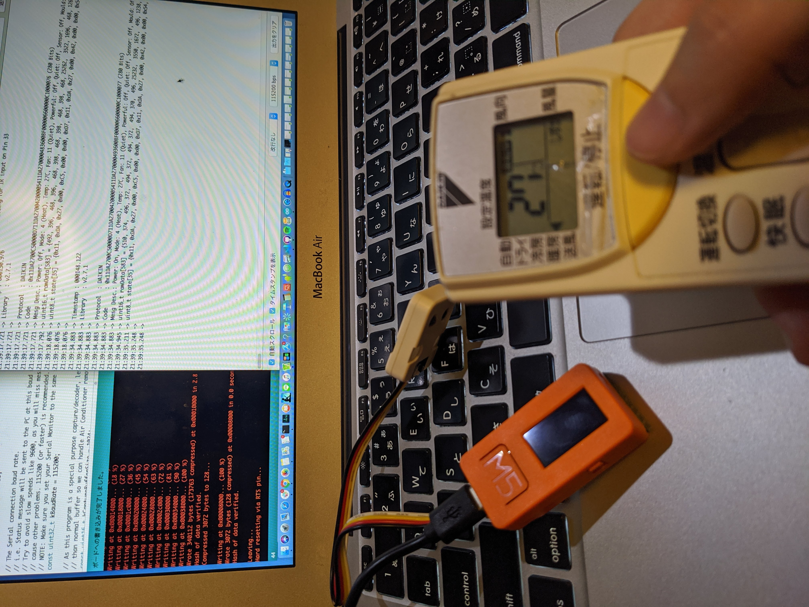

# スマートリモコンをM5StickCで自作し、Google Homeから家電を操作

## 概要

本章は、**M5StickCや電子工作に興味ある人に、「音声で操作するインタフェース」が「実はお手軽に追加できる」事を知ってもらいたくて書きました。**
VUIクラスタの人にも**軽率に電子工作沼にハマっていただきたい**ので、半田付けなどしなくても使えるケース付きの格安小型マイコンを使っております。

音声部分の開発にVoiceflowを使っており、アップロード先を変えればAmazon Echoにも対応できます。

IoTのプロトタイピングにも使えるいろんなテクを寄せ集めていますので、何かのヒントになると幸いです。

### やること

* M5StickCで自宅エアコンの赤外線リモコンを作成 
* AdafruitのMQTTブローカの設定 
* IFTTTでMQTTの簡易パブリッシャーを作る 
* VoiceflowでActions On Googleを作成 
* 全部つなげて動作確認


### 開発環境

* MacBook Air（OS: 10.13.6 High Sierra）
* VSCode
* Arduino IDE 1.8.9
* Google Home mini

自分はMacを使いましたが、Windowsにも共通のツールがあります。適宜読み替えて進めてください。

### 使用した部品

* M5StickC ¥1,980　
* M5用、赤外線送受信ユニット ¥308
@<fn>{sitopp_plice}

//footnote[sitopp_plice][値段は2020年1月12日時点でのスイッチサイエンスの通販税込価格です。]


//embed[latex]{
\clearpage
//}


## M5StickCで赤外線リモコン作成

あらかじめ、MacにArduino IDEをインストールして、M5StickCを使えるようにしておきます。

参考）

* 公式「M5StickCクイックスタート-Arduino Win」
https://docs.m5stack.com/#/ja/quick_start/m5stickc/m5stickc_quick_start_with_arduino_Windows

* 「くらつきねっと」さんの「M5StickC で開発を行うための Arduino IDE のセットアップ」
https://kuratsuki.net/2019/07/


### M5StickCで、赤外線リモコンの命令を読み込む

Mac上でArduino IDEを起動し、M5StickCをMacにUSB Type-Cケーブルで接続します。

* 「ツール」→「ボード」→「M5StickC」を選択します。
* 「ツール」→「シリアルポート」→表示された複数の選択肢の中から、「/dev/cu.usbserial-」の文字が入っているものを選択します。


* Arduino IDEの「ツール」→「ライブラリを管理」→「IRremoteESP8266」と入力し、表示されたライブラリをインストールします。
* 「ファイル」→「スケッチ例」→「IRremoteESP8266」→「IRrecvDumpV2」を開きます。
* 「ファイル」→「新規ファイル」でスケッチエディタを開き、上で開いた「IRrecvDumpV2」を全文コピーして貼り付け、以下の一行だけ書き換えます。

```
const uint16_t kRecvPin = 14;
↓
const uint16_t kRecvPin = 33;
```

* スケッチエディタの左上にある「→」アイコンをクリックして、M5StickCに書き込みします。
* 保存場所を聞かれるので、適当に指定します。
* 書き込みにかかる時間、数十秒を待ちます。
* スケッチエディタの下半分にインストールログがどどっと出力されます。以下のようなメッセージが出たらインストール完了です。

```
Writing at 0x00008000... (100 %)
Wrote 3072 bytes (128 compressed) at 0x00008000 in 0.0 seconds 
Hash of data verified.

Leaving...
Hard resetting via RTS pin...
```

* 「ツール」→「シリアルモニタ」をクリックして、窓を開きます。
* 「自動スクロール」にチェックが入っている事を確認しましょう。
* 「IRrecvDumpV2 is now running and waiting for IR input on Pin 33」というメッセージが出るはずです。

* M5StickCに置き換えたい家電のリモコンを持ってきてください。
* 赤外線ユニットの20〜30センチ以内でリモコンを操作してください。
* シリアルモニタにコードが出力されます。



例）Daikinのエアコン（古すぎて型番不明）
オフとオンを一回づつ押したところ

```
21:39:17.721 -> Timestamp : 000130.976
21:39:17.721 -> Library   : v2.7.1
21:39:17.721 -> 
21:39:17.721 -> Protocol  : DAIKIN
21:39:17.721 -> Code      : 0x11DA2700C50000D711DA270042000054（以下略）
21:39:17.721 -> Mesg Desc.: Power: Off, Mode: 4 (Heat), Temp: （以下略）
21:39:17.792 -> uint16_t rawData[583] = {492, 396, （略）466};  // DAIKIN
21:39:18.076 -> uint8_t state[35] = {0x11, 0xDA, 0x27, 0x00,（略）0x76};
21:39:18.076 -> 
21:39:18.076 -> 
21:39:34.883 -> Timestamp : 000148.122
21:39:34.883 -> Library   : v2.7.1
21:39:34.883 -> 
21:39:34.883 -> Protocol  : DAIKIN
21:39:34.883 -> Code      : 0x11DA2700C50000D711DA270042000054（以下略）
21:39:34.883 -> Mesg Desc.: Power: On, Mode: 4 (Heat), Temp:  （以下略）
21:39:34.945 -> uint16_t rawData[583] = {510, 374,（略）494};  // DAIKIN
21:39:35.211 -> uint8_t state[35] = {0x11, 0xDA, 0x27, 0x00,（略）0x77};
21:39:35.248 -> 
```

* このログを全文コピーして、メモ帳などに保存しておきます。


### 赤外線の命令の切り出し

赤外線リモコンの命令はメーカー間で統一されておらず、にフォーマットが違います。
この本ではDaikinのエアコンのやり方について説明します。
（他のメーカーについては、ググるといろいろ親切に解説してくださっているページがありますので、後ほど参考リンクを記載します。）

* Arduino IDEの「ツール」→「ライブラリをインクルード」→「ライブラリを管理」→「IRsend」と入力し、表示されたライブラリをインストールします。
* 以下のURLに、私が書いたDaikinの赤外線リモコンを送信するコードが置いてありますので、アクセスしてください。

https://github.com/sitopp/voiceflow_mqtt_M5StickC_IRremo-con/blob/master/M5StickC/IRsendDemo_DAIKIN.ino
※もしGithubで404が出た場合はGithubにログインしてください。（アカウントがない場合はまずは作ってからログインを。）

* Arduino IDEの「ファイル」→「新規ファイル」でスケッチエディタを開きます。下敷き表示されたコードは削除してください。
* IRsendDemo_DAIKIN.inoのコードをスケッチエディタに貼り付けてください。


```IRsendDemo_DAIKIN.ino
#include <M5StickC.h>
#include <IRremoteESP8266.h>
#include <IRsend.h>

const uint16_t kIrLed = 32;  
IRsend irsend(kIrLed);  

void setup() {
    irsend.begin();
}

void loop() {
  M5.update();

  // M5ボタン(BtnA)が押されたとき、エアコンつける
  if (M5.BtnA.wasPressed()) {
    uint8_t daikin_code[35] = {
        0x11, 0xDA, 0x27, 0x00, 0xC5, 0x00, 0x00, 0xD7,
        0x11, 0xDA, 0x27, 0x00, 0x42, 0x00, 0x00, 0x54,
        0x11, 0xDA, 0x27, 0x00, 0x00, 0x48, 0x38, 0x00,
        0x7F, 0x00, 0x00, 0x06, 0x60, 0x00, 0x00, 0xC1, 
        0x00, 0x00, 0x38}; 

    irsend.sendDaikin(daikin_code);
    delay(100);
  }

  // 右ボタン(BtnB)が押されたとき、エアコン消す
  if (M5.BtnB.wasPressed()) {
    uint8_t daikin_code[35] = {
        0x11, 0xDA, 0x27, 0x00, 0xC5, 0x00, 0x00, 0xD7,
        0x11, 0xDA, 0x27, 0x00, 0x42, 0x00, 0x00, 0x54, 
        0x11, 0xDA, 0x27, 0x00, 0x00, 0x49, 0x38, 0x00, 
        0x7F, 0x00, 0x00, 0x06, 0x60, 0x00, 0x00, 0xC1, 
        0x00, 0x00, 0x39}; 

    irsend.sendDaikin(daikin_code); //メーカー毎にクラスが異なる
    delay(100);
  }

}
```
